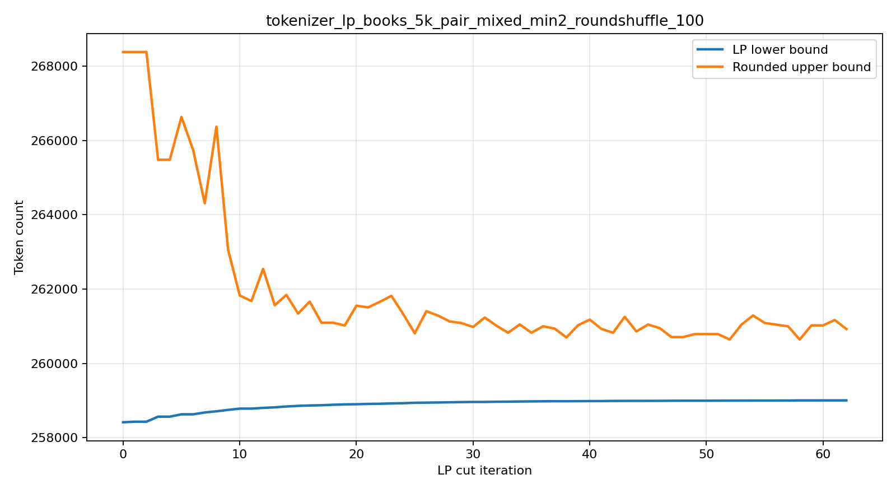

# Experiments

All runs used `~/Desktop/books/bl.txt`, copied from `10.9.0.4:~/Desktop/books`, unless noted otherwise.

## Smoke Corpus

Tiny two-file corpus in `/tmp/tokenizer_lp_smoke`, with `--vocab-size 280 --max-token-length 8`.

| Setup | Tokens | Bytes/token | Notes |
|---|---:|---:|---|
| LP, bytelevel pretok | 33 | 2.7576 | Initial CPU LP smoke. |
| BPE, bytelevel pretok | 32 | 2.8438 | BPE won this tiny smoke by 1 token. |
| LP exact DP, bytelevel pretok | 33 | 2.7576 | DP matched the relaxed bound exactly on this toy corpus. |

## Full Book Baselines

Common settings:

```bash
--data-dir ~/Desktop/books
--vocab-size 512
--max-token-length 8
--min-token-count 5
```

| Setup | Pretokenizer | LP Solve Time | Tokens | Bytes/token | Result |
|---|---|---:|---:|---:|---|
| LP, top-k rounding, Unigram runtime | bytelevel | 208.318s | 278,688 | 2.1193 | LP beat BPE by 182 tokens. |
| Greedy BPE | bytelevel | n/a | 278,870 | 2.1179 | Baseline. |
| LP, top-k rounding, Unigram runtime | nanochat | 209.306s | 268,378 | 2.2007 | LP beat BPE by 328 tokens. |
| Greedy BPE | nanochat | n/a | 268,706 | 2.1980 | Nanochat improved both tokenizers. |
| LP, top-k rounding, exact DP runtime | nanochat | 200.558s | 268,378 | 2.2007 | Exact DP matched prior Unigram count on this run. |

## LP Relaxation Bound

Run:

```bash
uv run tokenizer-lp-train \
  --data-dir ~/Desktop/books \
  --vocab-size 512 \
  --kind both \
  --output-dir /tmp/tokenizer_lp_books_nanochat_bound_out \
  --max-token-length 8 \
  --min-token-count 5 \
  --pretokenizer nanochat \
  --eval-workers 2
```

| Metric | Value |
|---|---:|
| LP relaxed lower bound | 258,417.000 tokens |
| LP implied bytes/token upper bound | 2.2855 |
| LP rounded exact-DP tokens | 268,378 |
| LP rounded exact-DP bytes/token | 2.2007 |
| Greedy BPE tokens | 268,706 |
| Greedy BPE bytes/token | 2.1980 |
| LP rounded gap vs relaxation | 3.7116% |

LP beat BPE by 328 tokens, while the relaxation showed roughly 3.7% headroom relative to rounded LP.

## Same-Colour Byte-Boundary Cuts

Cut family:

```text
sum_{e=(i,j), color(e)=tau, i <= b < j} f[e] <= t[tau]
```

Full book run:

```bash
uv run tokenizer-lp-train \
  --data-dir ~/Desktop/books \
  --vocab-size 512 \
  --kind lp \
  --output-dir /tmp/tokenizer_lp_books_nanochat_cuts_out \
  --max-token-length 8 \
  --min-token-count 5 \
  --pretokenizer nanochat \
  --eval-workers 2 \
  --lp-cut-rounds 5 \
  --lp-cuts-per-round 500
```

| Iteration | Cuts Added | Max Violation | LP Bound Tokens | Bound Bytes/token | Rounded Tokens | Rounded Bytes/token | Rounded Gap |
|---:|---:|---:|---:|---:|---:|---:|---:|
| 0 | 23 | 0.5 | 258,417.000 | 2.2855 | 268,378 | 2.2007 | 3.7116% |
| 1 | 0 | 0 | 258,420.750 | 2.2855 | 268,378 | 2.2007 | 3.7102% |

The cuts tightened the LP bound by 3.75 tokens but did not change the rounded DP tokenizer. The loop terminated early after iteration 1 because no violated cuts remained.

## Fractional LP Diagnostics

Diagnostic command:

```bash
uv run python -m tokenisation_lp.analyze_fractional_lp \
  --data-dir ~/Desktop/books \
  --vocab-size 512 \
  --max-token-length 8 \
  --min-token-count 5 \
  --pretokenizer nanochat \
  --top 20
```

The base relaxation had 288 fractional token-selection variables and 47,517 fractional non-free edge variables. Most high-ranked fractional values were exactly 0.5.

Useful violated cut families found:

| Family | Violations | Best Violation | Example |
|---|---:|---:|---|
| Same-colour byte-boundary | 23 | 0.5 | repeated newlines with token `ĊĊĊĊ` |
| Same-colour word-packing | 3 | 1.0 | `word='âĢľWooooow'`, token `oo`, `lhs=2`, `max_pack * t = 1` |
| Aggregate boundary activation | 23 | 0.5 | reduced to single-colour boundary cases in this run |

The word-packing cut is:

```text
sum_{e in occurrences(word, tau)} f[e] <= max_pack(word, tau) * t[tau]
```

where `max_pack` is the maximum number of non-overlapping occurrences of token colour `tau` in the pretokenized word.

## Boundary + Word-Packing Cuts

Run:

```bash
uv run tokenizer-lp-train \
  --data-dir ~/Desktop/books \
  --vocab-size 512 \
  --kind lp \
  --output-dir /tmp/tokenizer_lp_books_wordpack_out \
  --max-token-length 8 \
  --min-token-count 5 \
  --pretokenizer nanochat \
  --eval-workers 2 \
  --lp-cut-rounds 5 \
  --lp-cuts-per-round 500 \
  --lp-cut-families boundary,word_packing
```

| Iteration | Cuts Added | Max Violation | LP Bound Tokens | Bound Bytes/token | Rounded Tokens | Rounded Bytes/token | Rounded Gap |
|---:|---:|---:|---:|---:|---:|---:|---:|
| 0 | 26 | 1.0 | 258,417.000 | 2.2855 | 268,378 | 2.2007 | 3.7116% |
| 1 | 0 | 0 | 258,420.750 | 2.2855 | 268,378 | 2.2007 | 3.7102% |

The combined separator found the 23 boundary cuts plus 3 word-packing cuts. The final bound matched the boundary-only run, indicating these packing cuts were implied by the boundary cuts after re-solving on this corpus.

## Path-Configuration Cuts And LP Cache

Path-configuration cuts were added in conservative hitting-set form. For a word and integer threshold `K`, enumerate all complete paths using at most `K` tokens. If `S` is a hitting set of token colours that intersects every such short path, add:

```text
word_cost + K * sum_{tau in S} t[tau] >= K + 1
```

This is valid for the ILP: if no token in `S` is active, every path with `<= K` tokens is blocked, so the word needs at least `K + 1` tokens. If some token in `S` is active, the RHS relaxes to at most `1`, which every non-empty word path satisfies.

A synthetic separator check produced the expected row:

```text
path_config key=('path_config', 0, 1, (0,))
row: -f0 -g0 -g1 -t0 <= -2
```

Full book run:

```bash
uv run tokenizer-lp-train \
  --data-dir ~/Desktop/books \
  --vocab-size 512 \
  --kind lp \
  --output-dir /tmp/tokenizer_lp_books_pathconfig_out \
  --max-token-length 8 \
  --min-token-count 5 \
  --pretokenizer nanochat \
  --eval-workers 2 \
  --lp-cut-rounds 5 \
  --lp-cuts-per-round 500 \
  --lp-cut-families boundary,word_packing,path_config \
  --lp-solution-cache-dir /tmp/tokenizer_lp_solution_cache
```

| Iteration | Cuts Added | Max Violation | LP Bound Tokens | Rounded Tokens | Rounded Gap |
|---:|---:|---:|---:|---:|---:|
| 0 | 26 | 1.0 | 258,417.000 | 268,378 | 3.7116% |
| 1 | 0 | 0 | 258,420.750 | 268,378 | 3.7102% |

The path-configuration separator did not find extra violated cuts beyond the 23 boundary + 3 word-packing cuts on this corpus. Re-running the identical command with `--lp-solution-cache-dir /tmp/tokenizer_lp_solution_cache` hit both cached LP solves:

```text
iteration 0 cache hit solve time: 0.184s
iteration 1 cache hit solve time: 0.170s
```

## Path-Multicover Cuts

Path-multicover cuts generalize the hitting-set path cut. For a word and threshold `K`, if every complete path with at most `K` tokens uses at least `r` token colours from a set `S`, add:

```text
word_cost + (K / r) * sum_{tau in S} t[tau] >= K + 1
```

This is ILP-valid: an integral short path activates at least `r` tokens in `S`; otherwise the word must use at least `K + 1` tokens.

A synthetic separator check produced a violated row:

```text
path_multicover key=('path_multicover', 0, 2, 1, (1,))
row: -f0 -f1 -g0 -g1 -g2 -2*t1 <= -3
```

Full book run with all families:

```bash
uv run tokenizer-lp-train \
  --data-dir ~/Desktop/books \
  --vocab-size 512 \
  --kind lp \
  --output-dir /tmp/tokenizer_lp_books_multicover_out \
  --max-token-length 8 \
  --min-token-count 5 \
  --pretokenizer nanochat \
  --eval-workers 2 \
  --lp-cut-rounds 5 \
  --lp-cuts-per-round 500 \
  --lp-cut-families boundary,word_packing,path_config,path_multicover \
  --lp-solution-cache-dir /tmp/tokenizer_lp_solution_cache
```

The run loaded cached LP solutions. It still found only the same 26 first-round cuts and no second-round cuts:

| Iteration | Cuts Added | Max Violation | LP Bound Tokens | Rounded Tokens | Rounded Gap |
|---:|---:|---:|---:|---:|---:|
| 0 | 26 | 1.0 | 258,417.000 | 268,378 | 3.7116% |
| 1 | 0 | 0 | 258,420.750 | 268,378 | 3.7102% |

So the current multicover separator did not expose additional full-book violations beyond boundary and word-packing cuts.

## Weighted Global Token-Packing Cuts

Global token-packing cuts aggregate same-token packing across all pretokenized word types with corpus frequencies:

```text
sum_w freq[w] * sum_{e in occurrences(w, tau)} f[e]
  <= sum_w freq[w] * max_pack(w, tau) * t[tau]
```

This is just the weighted sum of same-colour word-packing inequalities for a single token colour, but it is compact and objective-weighted.

A synthetic separator check produced:

```text
global_token_packing key=('global_token_packing', 0)
row: 10*f0 + 10*f1 + f2 - 10*t0 <= 0
```

Full book run with only `global_token_packing`:

| Iteration | Cuts Added | Max Violation | LP Bound Tokens | Rounded Tokens | Rounded Gap |
|---:|---:|---:|---:|---:|---:|
| 0 | 1 | 25.5 | 258,417.000 | 268,378 | 3.7116% |
| 1 | 0 | 0 | 258,417.750 | 268,378 | 3.7113% |

Full book run with all current cut families:

```bash
uv run tokenizer-lp-train \
  --data-dir ~/Desktop/books \
  --vocab-size 512 \
  --kind lp \
  --output-dir /tmp/tokenizer_lp_books_allcuts_out \
  --max-token-length 8 \
  --min-token-count 5 \
  --pretokenizer nanochat \
  --eval-workers 2 \
  --lp-cut-rounds 5 \
  --lp-cuts-per-round 500 \
  --lp-cut-families boundary,word_packing,global_token_packing,path_config,path_multicover \
  --lp-solution-cache-dir /tmp/tokenizer_lp_solution_cache
```

| Iteration | Cuts Added | Max Violation | LP Bound Tokens | Rounded Tokens | Rounded Gap |
|---:|---:|---:|---:|---:|---:|
| 0 | 27 | 25.5 | 258,417.000 | 268,378 | 3.7116% |
| 1 | 0 | 0 | 258,420.750 | 268,378 | 3.7102% |

The global weighted cut was present in round 0, but the final bound still matched the local boundary + word-packing bound.

## Small-Rank Window-Overlap Cuts

Window-overlap cuts implement local subset-capacity separation:

1. Rank suspicious word types by weighted fractional edge mass.
2. Scan small byte windows in those words.
3. Pick the top fractional token colours in the window.
4. Enumerate every subset of those colours and compute the maximum compatible non-overlapping clipped window coverage for that subset.
5. Fit a modular upper bound on that subset-capacity function at the current fractional `t`.
6. Add:

```text
sum_{e in window, color(e) in C} overlap(e, window) * f[e]
  <= alpha + sum_{tau in C} beta_tau * t[tau]
```

Full book run with only `window_overlap`:

```bash
uv run tokenizer-lp-train \
  --data-dir ~/Desktop/books \
  --vocab-size 512 \
  --kind lp \
  --output-dir /tmp/tokenizer_lp_books_window_out \
  --max-token-length 8 \
  --min-token-count 5 \
  --pretokenizer nanochat \
  --eval-workers 2 \
  --lp-cut-rounds 2 \
  --lp-cuts-per-round 500 \
  --lp-cut-families window_overlap \
  --lp-solution-cache-dir /tmp/tokenizer_lp_solution_cache
```

| Iteration | Cuts Added | Max Violation | LP Bound Tokens | Rounded Tokens | Rounded Gap |
|---:|---:|---:|---:|---:|---:|
| 0 | 12 | 1.0 | 258,417.000 | 268,378 | 3.7116% |
| 1 | 0 | 0 | 258,417.167 | 268,239 | 3.6616% |

These cuts barely tightened the bound, but changed rounding and improved the rounded tokenizer by 139 tokens.

Full book run with every implemented family:

```bash
uv run tokenizer-lp-train \
  --data-dir ~/Desktop/books \
  --vocab-size 512 \
  --kind lp \
  --output-dir /tmp/tokenizer_lp_books_all_window_out \
  --max-token-length 8 \
  --min-token-count 5 \
  --pretokenizer nanochat \
  --eval-workers 2 \
  --lp-cut-rounds 5 \
  --lp-cuts-per-round 500 \
  --lp-cut-families boundary,word_packing,global_token_packing,path_config,path_multicover,window_overlap \
  --lp-solution-cache-dir /tmp/tokenizer_lp_solution_cache
```

| Iteration | Cuts Added | Max Violation | LP Bound Tokens | Rounded Tokens | Rounded Gap |
|---:|---:|---:|---:|---:|---:|
| 0 | 39 | 25.5 | 258,417.000 | 268,378 | 3.7116% |
| 1 | 0 | 0 | 258,420.750 | 268,378 | 3.7102% |

With all families enabled, the final rounded tokenizer returned to the prior 268,378-token result; the window cuts were most useful when applied alone.

## Pairwise Window-Conflict Cuts

Note: an earlier pairwise formula was asymmetric and invalid for cases where
`cA != cB`. The implementation was corrected to fit the valid modular upper
bound for the four binary activation subsets. The corrected pairwise family
matches the valid `window_overlap` behaviour on this corpus.

Pairwise window cuts are a cheaper special case of small-rank window overlap. For two colours `A,B` in a local window, compute:

- `cA`: max compatible clipped coverage using only `A`
- `cB`: max compatible clipped coverage using only `B`
- `cAB`: max compatible clipped coverage using either `A` or `B`

Then add:

```text
y_A + y_B <= cAB + (cA-cAB)*(1-t_A) + (cB-cAB)*(1-t_B)
```

Equivalently:

```text
y_A + y_B + (cA-cAB)*t_A + (cB-cAB)*t_B <= cA + cB - cAB
```

Corrected full book run:

```bash
uv run tokenizer-lp-train \
  --data-dir ~/Desktop/books \
  --vocab-size 512 \
  --kind lp \
  --output-dir /tmp/tokenizer_lp_books_windowpair_valid_out \
  --max-token-length 8 \
  --min-token-count 5 \
  --pretokenizer nanochat \
  --eval-workers 2 \
  --lp-cut-rounds 2 \
  --lp-cuts-per-round 500 \
  --lp-cut-families window_pair \
  --lp-solution-cache-dir /tmp/tokenizer_lp_solution_cache
```

| Iteration | Cuts Added | Max Violation | LP Bound Tokens | Rounded Tokens | Rounded Gap |
|---:|---:|---:|---:|---:|---:|
| 0 | 12 | 1.0 | 258,417.000 | 268,378 | 3.7116% |
| 1 | 0 | 0 | 258,417.167 | 268,239 | 3.6616% |

The corrected pairwise cut no longer gives the earlier apparent +7.85-token bound improvement; that result came from the invalid asymmetric formula and should not be used.

## Deep Window-Overlap Search

The deeper valid window search raises the suspicious-word scan from 250 to 1000, the colour rank from 4 to 6, and scans window lengths `(4,5,6,8,10,12,16)`.

```bash
uv run tokenizer-lp-train \
  --data-dir ~/Desktop/books \
  --vocab-size 512 \
  --kind lp \
  --output-dir /tmp/tokenizer_lp_books_windowdeep_out \
  --max-token-length 8 \
  --min-token-count 5 \
  --pretokenizer nanochat \
  --eval-workers 2 \
  --lp-cut-rounds 3 \
  --lp-cuts-per-round 1000 \
  --lp-cut-families window_overlap_deep \
  --lp-solution-cache-dir /tmp/tokenizer_lp_solution_cache
```

| Iteration | Cuts Added | Max Violation | LP Bound Tokens | Rounded Tokens | Rounded Gap |
|---:|---:|---:|---:|---:|---:|
| 0 | 42 | 1.0 | 258,417.000 | 268,378 | 3.7116% |
| 1 | 0 | 0 | 258,417.167 | 268,378 | 3.7115% |

It finds more valid local cuts than the default scan, but the same bound improvement.

## Global Pair-Packing Cuts

Global pair-packing cuts aggregate full-word interval capacities for token-colour pairs across high-fractionality words. For a token pair `(A,B)`, compute a weighted set capacity over each word and fit the valid two-colour modular upper bound globally.

Note: an earlier implementation sorted token-pair keys after computing capacities, which could attach singleton capacities to the wrong token. The corrected implementation keeps the capacity bit order consistent with the token tuple.

Full book run:

```bash
uv run tokenizer-lp-train \
  --data-dir ~/Desktop/books \
  --vocab-size 512 \
  --kind lp \
  --output-dir /tmp/tokenizer_lp_books_globalpair_out \
  --max-token-length 8 \
  --min-token-count 5 \
  --pretokenizer nanochat \
  --eval-workers 2 \
  --lp-cut-rounds 2 \
  --lp-cuts-per-round 500 \
  --lp-cut-families global_pair_packing \
  --lp-solution-cache-dir /tmp/tokenizer_lp_solution_cache
```

Corrected full book result:

| Iteration | Cuts Added | Max Violation | LP Bound Tokens | Rounded Tokens | Rounded Gap |
|---:|---:|---:|---:|---:|---:|
| 0 | 1 | 87 | 258,417.000 | 268,378 | 3.7116% |
| 1 | 0 | 0 | 258,417.069 | 268,378 | 3.7115% |

The corrected global-pair cut is valid but much weaker than the buggy first result.

## Global Triple-Packing Cuts

The global rank-packing separator was extended from pairs to triples with consistent capacity bit ordering.

```bash
uv run tokenizer-lp-train \
  --data-dir ~/Desktop/books \
  --vocab-size 512 \
  --kind lp \
  --output-dir /tmp/tokenizer_lp_books_globaltriple_out \
  --max-token-length 8 \
  --min-token-count 5 \
  --pretokenizer nanochat \
  --eval-workers 2 \
  --lp-cut-rounds 2 \
  --lp-cuts-per-round 500 \
  --lp-cut-families global_triple_packing \
  --lp-solution-cache-dir /tmp/tokenizer_lp_solution_cache
```

| Iteration | Cuts Added | Max Violation | LP Bound Tokens | Rounded Tokens | Rounded Gap |
|---:|---:|---:|---:|---:|---:|
| 0 | 1 | 15 | 258,417.000 | 268,378 | 3.7116% |
| 1 | 0 | 0 | 258,417.000 | 268,378 | 3.7116% |

The triple cut was violated at the base point but did not move the objective by itself.

## Residual Fractionality and Additional Cut Search

After adding the known valid same-colour byte-boundary and word-packing cuts on `~/Desktop/books`, the remaining solution is still highly fractional:

| Quantity | Value |
|---|---:|
| LP bound | 258,420.750 tokens |
| Positive token-selection variables | 399 |
| Fractional token-selection variables | 288 |
| Sum of token-selection variables | 254.000 |
| Fractional non-free edge variables | 47,730 |
| Fractional free edge variables | 20,820 |

The fractional token values are almost entirely half-integral:

| Fractional `t` value | Count |
|---:|---:|
| 0.50 | 278 |
| 0.25 | 7 |
| 0.75 | 3 |

Representative high-weight residual words look like mixtures of two equally good segmentations:

```text
word='Ġthere', freq=205, cost=2.0
  0.5 * ['Ġth', 'ere']  with t('Ġth')=1.0, t('ere')=0.5
  0.5 * ['Ġthe', 're']  with t('Ġthe')=1.0, t('re')=0.5

word='Ġyour', freq=240, cost=1.5
  0.5 * ['Ġyou', 'r']   with t('Ġyou')=1.0, byte fallback 'r'
  0.5 * ['Ġyour']       with t('Ġyour')=0.5
```

For a single word, these are not necessarily cuttable by a valid linear local inequality: the point can be a convex combination of two valid integral segmentations. This is why many local packing families either find nothing after the boundary cleanup or move only rounding/tie-breaking.

### New Families Tried

I implemented and tested these additional conservative families:

- `word_rank_count`: full-word small-rank interval capacity using edge count.
- `word_rank_length`: full-word small-rank interval capacity using covered byte length.
- `global_rank_count`: weighted corpus-level small-rank count-capacity cuts.
- `path_min_cover`: exact minimum-weight hitting-set version of the short-path cover cut.
- `group_value`: small token-set lower-envelope cuts over groups of words. For a token set `S`, it computes `F(U)` as the minimum weighted token count with `U subset S` active and every token outside `S` allowed, then adds an affine lower bound on `F`. This is valid because allowing all outside tokens can only make the bound weaker.

Separation at the base LP:

| Family | Cuts Found | Max Violation |
|---|---:|---:|
| `boundary` | 23 | 0.5 |
| `word_packing` | 3 | 1 |
| `global_token_packing` | 1 | 25.5 |
| `global_pair_packing` | 1 | 87 |
| `global_triple_packing` | 1 | 15 |
| `global_rank_count` | 2 | 10.5 |
| `word_rank_count` | 0 | 0 |
| `word_rank_length` | 2 | 1 |
| `path_config` | 0 | 0 |
| `path_multicover` | 0 | 0 |
| `path_min_cover` | 0 | 0 |
| `group_value` | 0 | 0 |
| `window_overlap` | 12 | 1 |
| `window_overlap_deep` | 42 | 1 |
| `word_path_cover` | 0 | 0 |
| `window_pair` | 12 | 1 |

Separation after the 26 boundary + word-packing cleanup cuts:

| Family | Cuts Found | Max Violation |
|---|---:|---:|
| all implemented families above | 0 | 0 |

Bound-moving runs for the new families:

| Family | Bound After Cuts | Bound Gain | Rounded Tokens | Notes |
|---|---:|---:|---:|---|
| `word_rank_count` | 258,417.000 | 0 | 268,378 | No cuts found at base. |
| `word_rank_length` | 258,417.100 | +0.100 | 266,972 | Valid but only changes rounding/tie-breaking materially. |
| `global_rank_count` | 258,417.000 | 0 | 268,378 | Two violated cuts, no objective movement. |
| `path_min_cover` | 258,417.000 | 0 | 268,378 | No cuts found. |
| `group_value` | 258,417.000 | 0 | 268,378 | No cuts found with rank-8 candidate sets. |
| `boundary,word_packing,word_rank_length` | 258,420.750 | +3.750 | 268,378 | Same bound as boundary + word-packing alone. |

The `word_rank_length` rounded result is not evidence of a stronger relaxation; the LP bound only improves by 0.100 token, so the rounded tokenizer changed because the tiny perturbation changed token ordering around fractional ties.

### Validity Checks and Rejected Ideas

The large-looking base violations for `global_pair_packing`, `global_rank_count`, and related cuts are not enough by themselves. After solving with the cuts, the bound movement is tiny or zero. I treated earlier big jumps as suspect until the formulas were checked against all binary activation subsets; the previous asymmetric pair formula and the old global pair bit-ordering bug were invalid and should remain discarded.

The tempting "conflicting edges <= max(active colour)" cut is not useful as a linear LP cut in this formulation. For a clique of overlapping intervals, `sum f_e <= 1` is already implied by the word flow across the shared byte boundary. A max activation RHS would require an auxiliary `m = max(t_i)`. The convex linear relaxation has `m >= t_i`, and because `m` only appears on the RHS, the LP can raise `m` to satisfy the cut. Without a nonconvex equality or an objective penalty on `m`, it collapses to the existing boundary/flow information.

The remaining gap appears to be a global decomposition issue: many words are locally convex combinations of valid paths, and the token budget polytope itself is integral, but the LP can use different fractional path mixtures for different words under the same half-integral token vector. Local interval-packing, same-colour, small-window, and small-rank value cuts do not detect an inconsistency after the boundary cleanup.

Potential next directions that are more likely to tighten the relaxation:

- **Global scenario/decomposition cuts:** try to prove that the current `(t, f)` cannot be decomposed into a convex combination of a small number of integral vocabularies and their induced shortest paths.
- **Column-generation over vocabularies:** solve a master problem over integral token sets/tokenizers for the current fractional support; violated decomposition constraints would be directly meaningful.
- **Larger group value cuts:** increase `group_value` rank and construct token sets by clustering half-integral tokens globally rather than seeding from one word. This is valid but may get expensive quickly.
- **Branch-and-cut style local branching:** temporarily branch on a cluster of half-integral tokens, solve both child LPs, and derive disjunctive cuts if both children imply a higher bound. This is stronger than modular local cuts but substantially more complex.

## Split Branching Bounds

I added a diagnostic branch tool:

```bash
uv run tokenizer-lp-branch-split \
  --data-dir ~/Desktop/books \
  --vocab-size 512 \
  --pretokenizer nanochat \
  --min-token-count 5 \
  --max-token-length 8 \
  --cut-rounds 1 \
  --cuts-per-round 500 \
  --cut-families boundary,word_packing \
  --max-candidates 30 \
  --max-nodes 40 \
  --max-depth 3 \
  --incumbent-tokens 266972
```

The tool starts from a live HiGHS basis, adds the cleanup cuts, and then changes token activation bounds in place. For a binary token variable `t_i`, the split disjunction is:

```text
t_i = 0  OR  t_i = 1
```

If the child LP bounds are `L0` and `L1`, then every integral tokenizer must have objective at least `min(L0, L1)`. Equivalently, the branch proof can add the ILP-valid objective cutoff:

```text
c^T x >= min(L0, L1)
```

This is not a local packing inequality, but it is a valid split cut for the integer problem.

Book run results:

| Bound Source | Certified Bound | Gain vs Cleanup LP |
|---|---:|---:|
| Cleanup LP (`boundary,word_packing`) | 258,420.750 | 0 |
| Best one-token split | 258,550.000 | +129.250 |
| Depth-3 adaptive split tree | 258,698.500 | +277.750 |

Best one-token splits from the 30-token sweep:

| Token | Root `t` | Child `t=0` Bound | Child `t=1` Bound | Split Bound |
|---|---:|---:|---:|---:|
| `me` | 0.5 | 258,598.750 | 258,550.000 | 258,550.000 |
| `hi` | 0.5 | 258,637.500 | 258,542.500 | 258,542.500 |
| `ou` | 0.5 | 258,562.250 | 258,535.250 | 258,535.250 |
| `ng` | 0.5 | 258,530.750 | 258,535.500 | 258,530.750 |
| `Ġm` | 0.5 | 258,864.000 | 258,525.000 | 258,525.000 |

The shallow branch tree branched adaptively on high-impact fractional tokens and fully closed the depth-3 tree in this run. The correct certified bound is the minimum leaf bound, not the maximum leaf bound; an earlier smoke check caught this reporting pitfall. The depth-3 result therefore certifies `258,698.500`, not the largest observed leaf bound.

This is the first tested direction after the local cuts that materially tightens the bound. It supports the diagnosis that the remaining relaxation gap is mostly token-activation integrality, not missing local interval packing.

## Conflict Clique and Odd-Cycle Cuts

I also tested clique and odd-cycle cuts of the form:

```text
sum_{e in clique} x_e <= 1
sum_{e in odd cycle C} x_e <= floor(|C| / 2)
```

The safe conflict graph here is the per-word interval conflict graph: vertices are concrete token/free-byte interval edges in one pretokenized word, and two vertices conflict when their spans overlap. This is valid because an integral segmentation path can only use non-overlapping intervals.

I did **not** apply these cuts directly to token colours globally. Two token colours are generally allowed to coexist in the same vocabulary, so a global token-colour conflict graph would not be ILP-valid without an additional disjunctive proof.

Book separation result:

| LP Point | Family | Cuts Found | Max Violation |
|---|---|---:|---:|
| Base LP | `conflict_clique` | 0 | 0 |
| Base LP | `conflict_odd_cycle` | 0 | 0 |
| Base LP | `boundary,word_packing` | 26 | 1 |
| After boundary + word-packing cleanup | `conflict_clique` | 0 | 0 |
| After boundary + word-packing cleanup | `conflict_odd_cycle` | 0 | 0 |

This matches the structure of interval graphs. Pairwise overlap graphs of intervals are perfect, so odd-cycle inequalities are implied by clique inequalities. The clique inequalities themselves are already implied by the word flow constraints: every complete path crosses each byte boundary exactly once, so the sum of all interval-edge flow crossing a boundary is already at most/equal to one. The half-integral residual is therefore not an uncut stable-set odd-cycle artifact in the edge-overlap graph.

Conclusion: clique/odd-cycle cuts are valid in the edge-conflict graph, but redundant for this LP. The useful “odd-cycle-like” phenomenon appears to live in token activation/disjunction space, which is why explicit split branching tightened the bound while local conflict graph cuts did not.

## Word Segmentation-Support Cuts

I tested a path-mixture version of the proposed repeated-word support idea.

For one repeated word type `w`, enumerate every segmentation path `p` when the
path count is small enough. For a selected token-colour set `S`, each path has
a required support value:

```text
r(p) = |R(p) cap S|
```

where `R(p)` is the set of non-free token colours used by `p`. In any integral
tokenizer using path `p`:

```text
r(p) <= sum_{tau in S} t_tau
```

To project this to the existing edge-flow variables, solve the small dual:

```text
max   y · f_w + gamma
s.t.  y · incidence(p) + gamma <= r(p)   for every segmentation path p of w
```

Any feasible dual solution gives the valid cut:

```text
y · f_w + gamma <= sum_{tau in S} t_tau
```

The separator only emits a cut if all segmentations of the word were enumerated
exactly. This avoids the common invalid shortcut where a cut is generated from
an incomplete path list.

Book results:

| Cut Families | Final Bound | Gain vs Base | Gain vs Boundary Cleanup | Rounded Tokens |
|---|---:|---:|---:|---:|
| `word_support` | 258,417.750 | +0.750 | n/a | 268,378 |
| `boundary,word_packing` | 258,420.750 | +3.750 | 0 | 268,378 |
| `boundary,word_packing,word_support` | 258,421.500 | +4.500 | +0.750 | 268,378 |

Separated support cuts:

| LP Point | Cuts Found | Max Violation | Example Words |
|---|---:|---:|---|
| Base LP | 5 | 0.5 | `Ġsentence`, `Ġsentences`, `Ġindependent`, `Ġoptimistic`, `Ġfurniture` |
| After boundary + word-packing cleanup | 2 | 0.5 | `Ġoptimistic`, `Ġfurniture` |

This family is valid and matches the intended “average segmentation mixture needs enough colour support” idea. On this corpus it is real but weak: it adds another `+0.750` tokens to the relaxed bound after cleanup. The useful cuts came from relatively low-frequency repeated words, so the objective movement is small.

## Bad-Vocabulary Escape Cuts

I also tried the more literal Benders-like version based on a nearby integral vocabulary. The separator rounds the current fractional colour vector to the top `sum(t)` token colours, computes each word's rounded-vocabulary cost `K`, and enumerates every path with `< K` tokens.

Two variants were tested:

- `bad_vocab_escape`: find a hitting set `H` of all paths better than the rounded vocabulary and add:

  ```text
  word_cost >= K * (1 - sum_{tau in H} t_tau)
  ```

- `bad_vocab_improvement`: for the off-vocabulary escape tokens, compute the set function `cap(U)` = best token-count improvement achievable by a better path whose off-vocab tokens are contained in `U`; add a modular upper bound:

  ```text
  K - word_cost <= alpha + sum beta_tau t_tau
  ```

The second form is stronger because it bounds the amount of improvement, not just whether any better path is possible.

Diagnostics at the base LP showed many words where the rounded vocab is much worse than the fractional LP:

```text
bad rounded words: 5,851
total weighted rounded-vs-LP gap: 33,976.25 token occurrences
```

Examples:

| Word | Freq | Rounded Cost K | LP Word Cost | Gap |
|---|---:|---:|---:|---:|
| `Ġwhen` | 231 | 4 | 1.5 | 2.5 |
| `âĢĻd` | 224 | 4 | 1.5 | 2.5 |
| `Ġmore` | 169 | 4 | 1.5 | 2.5 |
| `Ġalways` | 107 | 5 | 2.0 | 3.0 |

However, the simple hitting-set cut was too weak: for these high-weight words, the current fractional `t` vector already has enough total escape-token support, so the cut is satisfied.

Book results:

| Cut Families | Final Bound | Gain vs Base | Gain vs Boundary Cleanup | Rounded Tokens |
|---|---:|---:|---:|---:|
| `bad_vocab_escape` | 258,417.000 | 0 | n/a | 268,378 |
| `bad_vocab_improvement` | 258,417.750 | +0.750 | n/a | 268,378 |
| `boundary,word_packing,bad_vocab_improvement` | 258,420.750 | +3.750 | 0 | 268,378 |

So the bad-vocabulary Benders idea is valid in this escape-set form, and the improvement-capacity version does cut the base LP. But after the boundary/word-packing cleanup, it does not add anything on this corpus. The stronger `word_support` dual cut remains slightly better because it is derived from the current fractional word-flow mixture rather than from one rounded vocabulary.

## Word-Support Effort Sweep

I added three CLI knobs for the exact `word_support` separator:

- `--lp-word-support-max-words`: number of suspicious word types scanned.
- `--lp-word-support-max-rank`: number of fractional token colours selected for one support cut.
- `--lp-word-support-max-paths`: exact segmentation path enumeration cap per word.

The goal was to check whether cranking CPU finds materially stronger support cuts. All runs below used the books corpus, `vocab_size=512`, nanochat pretokenization, `max_token_length=8`, `min_token_count=5`, HiGHS, and the LP solution cache in `/tmp/tokenizer_lp_solution_cache`.

Full train-loop results with `word_support` alone:

| Setting | Limits `(words, rank, paths)` | Final Bound | Gain vs Base | Cuts by Round | Wall Time |
|---|---:|---:|---:|---|---:|
| small | `(500, 10, 20k)` | 258,417.750 | +0.750 | `5, 1, 0` | 14.73s |
| default | `(2000, 20, 100k)` | 258,417.750 | +0.750 | `5, 1, 0` | 14.70s |
| deep | `(5000, 30, 300k)` | 258,417.750 | +0.750 | `5, 1, 0` | 14.82s |

Full train-loop results with cleanup plus `word_support`:

| Setting | Limits `(words, rank, paths)` | Final Bound | Gain vs Base | Cuts by Round | Wall Time |
|---|---:|---:|---:|---|---:|
| small | `(500, 10, 20k)` | 258,421.500 | +4.500 | `31, 2, 0` | 16.51s |
| default | `(2000, 20, 100k)` | 258,421.500 | +4.500 | `31, 2, 0` | 16.58s |
| deep | `(5000, 30, 300k)` | 258,421.500 | +4.500 | `31, 2, 0` | 16.69s |
| xdeep | `(12000, 50, 1000k)` | 258,421.500 | +4.500 | `31, 2, 0` | 16.64s |

Direct separation timing on cached LP points shows where the CPU goes:

| LP Point | Setting | Limits `(words, rank, paths)` | Cuts | Max Violation | Separator Time |
|---|---|---:|---:|---:|---:|
| Base | tiny | `(100, 8, 5k)` | 0 | 0 | 0.115s |
| Base | small | `(500, 10, 20k)` | 0 | 0 | 0.393s |
| Base | default | `(2000, 20, 100k)` | 5 | 0.5 | 3.723s |
| Base | deep | `(5000, 30, 300k)` | 8 | 1.0 | 7.639s |
| Base | xdeep | `(12000, 50, 1000k)` | 8 | 1.0 | 8.069s |
| Cleanup | tiny | `(100, 8, 5k)` | 0 | 0 | 0.087s |
| Cleanup | small | `(500, 10, 20k)` | 0 | 0 | 0.391s |
| Cleanup | default | `(2000, 20, 100k)` | 2 | 0.5 | 3.722s |
| Cleanup | deep | `(5000, 30, 300k)` | 4 | 1.0 | 7.277s |
| Cleanup | xdeep | `(12000, 50, 1000k)` | 4 | 1.0 | 8.056s |

The direct separator can find a few additional candidate inequalities at deeper settings, but those candidates did not improve the final LP bound on this corpus. The useful bound movement saturates at `+0.750` from `word_support`, and the combined cleanup result saturates at `+4.500`. Past the default setting, extra CPU mostly finds redundant or non-binding cuts.

## Ordered Cut-Family Followup

I tried the remaining proposed cut directions in order on the books corpus with
`vocab_size=512`, nanochat pretokenization, `max_token_length=8`,
`min_token_count=5`, HiGHS, and cached LP solves in
`/tmp/tokenizer_lp_solution_cache`.

### 1. Threshold / Value-Function Cuts

Implemented as `threshold_value`. For one word and selected fractional token
colours `S`, compute the exact value function:

```text
F(U) = shortest segmentation cost when U subset S is active
```

All token colours outside `S` are left unrestricted, so `F` is a valid lower
bound for the full ILP. The separator adds the best affine lower bound on `F`
at the current fractional `t[S]`.

Result: no violated cuts.

| Families | Final Bound | Added vs Base | Wall Time |
|---|---:|---:|---:|
| `threshold_value` | 258,417.000 | 0 | 3.52s |
| `boundary,word_packing,threshold_value` | 258,420.750 | +3.750 | 5.86s |

This suggests the current remaining fractional examples are not explained by a
single-word shortest-cost lower envelope over only the selected colours. The
path-mixture support constraints are the stronger per-word view here.

### 2. Exact Per-Word Path-Hull Support Cuts

Implemented as `word_hull`. For a word and selected colours `S`, enumerate all
segmentation paths and optimize a nonnegative token-support dual:

```text
y · incidence(path) + gamma <= sum_{tau in R(path) cap S} b_tau
b_tau >= 0
sum_tau b_tau <= 1
```

This gives the valid cut:

```text
y · flow + gamma <= b · t
```

The `sum b <= 1` constraint only normalizes the separator; any nonnegative
`b` satisfying the path inequalities gives a valid support cut. The separator
only emits cuts when every path for the word was enumerated.

Result: this is the best new family so far.

| Families | Final Bound | Gain vs Base | Gain vs Boundary Cleanup | Cuts by Round | Wall Time |
|---|---:|---:|---:|---|---:|
| `word_hull` | 258,418.750 | +1.750 | n/a | `5, 1, 0` | 207.28s |
| `boundary,word_packing,word_hull` | 258,422.500 | +5.500 | +1.750 | `31, 1, 0` | 218.05s |
| `boundary,word_packing,word_hull,word_support` | 258,422.500 | +5.500 | +1.750 | `36, 0` | 235.54s |

The first-round `word_hull` cuts target the same five words as
`word_support`, but the optimized coefficients move the LP more:

| Word | Frequency | Violation | Selected Colours |
|---|---:|---:|---:|
| `Ġsentence` | 10 | 0.5 | 6 |
| `Ġsentences` | 5 | 0.5 | 5 |
| `Ġfurniture` | 4 | 0.5 | 6 |
| `Ġoptimistic` | 3 | 0.5 | 8 |
| `Ġindependent` | 2 | 0.5 | 8 |

`word_support` adds no extra bound once `word_hull` is present, so this looks
like the cleaner replacement for that branch.

### 3. Multi-Word Value Cuts

Retested existing `group_value` and added a deeper alias `group_value_deep`
that scans more seed words, more candidate words, larger groups, and rank-10
token sets. These are valid multi-word lower-envelope cuts over a shared token
set, again leaving all outside tokens unrestricted.

Result: no violated cuts.

| Families | Final Bound | Added vs Base | Wall Time |
|---|---:|---:|---:|
| `group_value` | 258,417.000 | 0 | 4.44s |
| `group_value_deep` | 258,417.000 | 0 | 15.03s |
| `boundary,word_packing,group_value_deep` | 258,420.750 | +3.750 | 31.36s |

The candidate shared-token groups I tried do not expose a multi-word
incompatibility beyond what the per-word and cleanup cuts already see.

### 4. Ranked Local-Vocabulary Budget Cuts

Implemented as `group_budget_value`. For a group of words `G` and selected
token set `S`, compute:

```text
B(k) = best weighted segmentation cost using at most k active colours from S
```

Then add the best affine lower bound depending only on `sum_{tau in S} t_tau`.
This is weaker than full `group_value` for the same `(G,S)`, but it tests the
specific local-vocabulary-budget hypothesis.

Result: no violated cuts.

| Families | Final Bound | Added vs Base | Wall Time |
|---|---:|---:|---:|
| `group_budget_value` | 258,417.000 | 0 | 4.91s |
| `boundary,word_packing,group_budget_value` | 258,420.750 | +3.750 | 8.82s |

This does not seem like the remaining weakness on the books corpus.

### 5. Lifted Window / Boundary Cuts

Retested the existing lifted local window families together:
`window_pair,window_overlap_deep`. These compute compatible local interval
packing capacities over suspicious byte windows and selected token colours.

Result: many cuts separate, but they barely move the bound, and after standard
cleanup they do not move it at all.

| Families | Final Bound | Gain vs Base | Gain vs Boundary Cleanup | Cuts by Round | Wall Time |
|---|---:|---:|---:|---|---:|
| `window_pair,window_overlap_deep` | 258,417.167 | +0.167 | n/a | `54, 0` | 238.96s |
| `boundary,word_packing,window_pair,window_overlap_deep` | 258,420.750 | +3.750 | 0 | `80, 11, 0` | 253.90s |

The local window cuts are valid and visibly violated, but they are mostly
redundant with the standard cleanup rows for objective purposes.

Current best relaxation from these tests:

| Families | Final Bound | Gain vs Base | Rounded Tokens |
|---|---:|---:|---:|
| Base LP | 258,417.000 | 0 | 268,378 |
| `boundary,word_packing` | 258,420.750 | +3.750 | 268,378 |
| `boundary,word_packing,word_support` | 258,421.500 | +4.500 | 268,378 |
| `boundary,word_packing,word_hull` | 258,422.500 | +5.500 | 268,378 |

The useful next direction is therefore not broader single-word value functions
or local window packing. The clearest remaining signal is exact path-support
hull separation; improving its CPU cost or batching many word-hull cuts is the
most promising path from this set.

## Experimental Full Short-Word Hulls

I implemented `short_word_full_hull` to test how much the restricted
`word_hull` separator leaves on the table.

This separator is broader than `word_hull`. For a short word, it uses all local
token colours when the count is below a cap, enumerates every segmentation path,
and separates over the upward local hull:

```text
choose one path p
t_S may be any binary superset of colours used by p
```

Equivalently, it searches arbitrary signed inequalities over word edge-flow and
`t[S]`, with an L1 coefficient normalization, and enforces validity for the
whole upward closure of every path. This is still a projection onto selected
local colours; it does not add auxiliary path variables to the main LP.

The upward closure is important. A token can be globally selected but unused by
this word, so a local colour-support variable must not be equated with global
`t`. The valid local integer vertices are path plus any selected-token superset.

On the base books LP, raw-frequency short words did not produce cuts:

| Scan | Candidates | Scanned | Cuts | Separator Time |
|---|---:|---:|---:|---:|
| `len<=8`, top 250 frequent/fractional | 7,420 | 250 | 0 | 0.225s |
| `len<=8`, top 1000 frequent/fractional | 7,420 | 1000 | 0 | 0.942s |
| `len<=10`, top 1000 frequent/fractional | 9,689 | 1000 | 0 | 1.243s |
| `len<=12`, top 1000 frequent/fractional | 10,592 | 1000 | 0 | 1.389s |

Ranking by fractional signal instead finds cuts, mostly on low-frequency short
words:

| Scan | Checked | Cuts | Max Normalized Violation | Separator Time |
|---|---:|---:|---:|---:|
| `len<=10`, top 2000 signal | 1,999 | 3 | 0.125 | 4.049s |
| `len<=12`, top 2000 signal | 1,999 | 5 | 0.125 | 7.316s |
| `len<=12`, all signal | 10,262 | 31 | 0.1667 | 37.676s |
| `len<=16`, all signal | 10,592 | 32 | 0.1667 | 86.237s |

Example full-hull cuts from the all-signal scan:

| Word | Length | Frequency | Local Colours | Paths | Violation |
|---|---:|---:|---:|---:|---:|
| `Ġheeeere` | 8 | 1 | 10 | 72 | 0.1667 |
| `âĢľWooow` | 8 | 1 | 13 | 72 | 0.1667 |
| `âĢľWooooow` | 10 | 1 | 13 | 248 | 0.1667 |
| `âĢľNoooo` | 8 | 2 | 12 | 88 | 0.1667 |
| `Ġsentences` | 10 | 5 | 41 | 509 | 0.125 |
| `Ġsentence` | 9 | 10 | 34 | 255 | 0.125 |

Book training results with `len<=12`, up to 12k signal-ranked words, and up to
96 local colours:

| Families | Active Cuts | Final Bound | Gain vs Base | Rounded Tokens | Wall Time |
|---|---:|---:|---:|---:|---:|
| `short_word_full_hull` | 42 | 258,431.750 | +14.750 | 268,378 | 330.43s |
| `boundary,word_packing,short_word_full_hull` | 67 | 258,432.000 | +15.000 | 268,378 | 342.12s |

This is the largest tightening so far. The standard cleanup rows add only
`+0.250` once these full local hull cuts are present, so this family is
capturing most of the previous cleanup signal and more.

The bottleneck remains the main LP resolve, not hull separation:

- Full-hull separation for `len<=12`, all signal-ranked words: `37.676s`.
- First LP resolve after 38 full-hull cuts: `210.718s`.
- First LP resolve after 64 cleanup+full-hull cuts: `219.543s`.

The result looks plausible rather than too good to be true: the bound is still
well below the rounded tokenizer count (`268,378`), leaving about `9,946` tokens
of rounded gap after the best cut batch.

## Experimental Short-Word Pair Hulls

I added `short_word_pair_hull` after checking that pair hulls should only be
separated after individual word hulls are already satisfied. The combined
separator enforces this by skipping pair separation in any round where
`short_word_full_hull` still finds cuts.

The pair separator:

- ranks short words by fractional colour/edge signal;
- proposes pairs through shared fractional token colours;
- enumerates both words' paths exactly;
- separates the full upward hull of the path-pair product;
- skips pairs whose path-product row count exceeds a cap;
- tests pair separator LPs in parallel worker processes.

Books run:

```bash
uv run tokenizer-lp-train \
  --data-dir ~/Desktop/books \
  --vocab-size 512 \
  --kind lp \
  --max-token-length 8 \
  --min-token-count 5 \
  --pretokenizer nanochat \
  --lp-cut-rounds 5 \
  --lp-cuts-per-round 1000 \
  --lp-cut-families short_word_full_hull,short_word_pair_hull \
  --lp-short-word-full-hull-max-words 12000 \
  --lp-short-word-full-hull-max-length 12 \
  --lp-short-word-full-hull-max-colors 96 \
  --lp-short-word-pair-hull-max-words 500 \
  --lp-short-word-pair-hull-max-length 12 \
  --lp-short-word-pair-hull-max-colors 96 \
  --lp-short-word-pair-hull-max-pair-rows 250000 \
  --lp-short-word-pair-hull-max-pairs 800 \
  --lp-short-word-pair-hull-top-words-per-color 36 \
  --lp-short-word-pair-hull-workers 8 \
  --lp-word-support-max-paths 100000 \
  --lp-solver highspy \
  --lp-solution-cache-dir /tmp/tokenizer_lp_solution_cache
```

Result:

| Iteration | Active Cuts | New Cuts | Family Effect | LP Bound | Rounded Tokens |
|---:|---:|---:|---|---:|---:|
| 0 | 0 | 38 | individual full hull | 258,417.000 | 268,378 |
| 1 | 38 | 4 | individual full hull | 258,431.750 | 268,378 |
| 2 | 42 | 19 | pair hull | 258,431.750 | 268,378 |
| 3 | 61 | 4 | individual full hull | 258,512.542 | 268,218 |
| 4 | 65 | 1 | pair hull | 258,513.542 | 268,218 |
| 5 | 66 | 0 | done | 258,513.542 | 268,218 |

This needed five cut-separation rounds before convergence under the configured
limits. The sixth LP solve found no remaining individual or pair hull cuts, with
66 active cuts total.

Best bound so far:

| Families | Final Bound | Gain vs Base | Rounded Tokens |
|---|---:|---:|---:|
| Base LP | 258,417.000 | 0 | 268,378 |
| `short_word_full_hull` | 258,431.750 | +14.750 | 268,378 |
| `short_word_full_hull,short_word_pair_hull` | 258,513.542 | +96.542 | 268,218 |

Pair examples found after individual word hulls were active:

| Left Word | Right Word | Violation |
|---|---|---:|
| `Ġromance` | `Ġroom` | 0.0833 |
| `Ġsense` | `Ġseen` | 0.0833 |
| `Ġseen` | `Ġsensation` | 0.0833 |
| `Ġroom` | `Ġromantic` | 0.0833 |
| `Ġwater` | `Ġmatter` | 0.0769 |
| `Ġlast` | `Ġleast` | 0.0714 |
| `Ġwhere` | `Ġwere` | 0.0714 |
| `Ġmake` | `Ġmistake` | 0.0625 |

Multiprocessing timing:

| Pair Round | Candidates | Tested Tasks | Pair Cuts | Workers | Wall Time | Worker Build Time | Worker Solve Time |
|---:|---:|---:|---:|---:|---:|---:|---:|
| 2 | 9,346 | 792 | 19 | 8 | 22.490s | 4.763s | 10.544s |
| 4 | 9,487 | 783 | 1 | 8 | 22.979s | 0.368s | 0.830s |

The pair-testing bottleneck is mostly many independent small separator LPs plus
multiprocessing overhead, not path enumeration. In serial, the same first pair
test took about `154s`; with 8 workers it dropped to about `22.5s`. The main
end-to-end bottleneck is still the large LP resolve after adding cuts: the
iteration after pair rows took `235s` to resolve.

### 10x Pair Candidate Sweep

I reran the books experiment with the same full-hull settings but increased
`--lp-short-word-pair-hull-max-pairs` from `800` to `8000`, and kept
`--lp-cut-rounds 10`.

Result:

| Iteration | Active Cuts | New Cuts | Family Effect | LP Bound | Rounded Tokens |
|---:|---:|---:|---|---:|---:|
| 0 | 0 | 38 | individual full hull | 258,417.000 | 268,378 |
| 1 | 38 | 4 | individual full hull | 258,431.750 | 268,378 |
| 2 | 42 | 75 | pair hull | 258,431.750 | 268,378 |
| 3 | 117 | 4 | individual full hull | 258,620.646 | 264,819 |
| 4 | 121 | 22 | pair hull | 258,620.895 | 264,663 |
| 5 | 143 | 2 | pair hull | 258,633.333 | 264,270 |
| 6 | 145 | 0 | done | 258,633.333 | 265,807 |

This converged under the higher round cap. It materially improved both the
relaxed bound and the rounded tokenizer:

| Families / Setting | Final Bound | Gain vs Base | Rounded Tokens | Wall Time |
|---|---:|---:|---:|---:|
| `short_word_full_hull,short_word_pair_hull`, 800 pairs | 258,513.542 | +96.542 | 268,218 | 475.77s |
| `short_word_full_hull,short_word_pair_hull`, 8000 pairs | 258,633.333 | +216.333 | 265,807 | 1959.67s |

Pair-separation timing with 8 workers:

| Pair Round | Candidates | Tested Tasks | Pair Cuts | Wall Time | Worker Build Time | Worker Solve Time |
|---:|---:|---:|---:|---:|---:|---:|
| 2 | 9,346 | 7,912 | 75 | 313.269s | 18.064s | 40.137s |
| 4 | 9,810 | 7,858 | 22 | 349.903s | 6.335s | 14.232s |
| 5 | 9,620 | 7,825 | 2 | 383.556s | 0.762s | 1.730s |
| 6 | 9,565 | 7,834 | 0 | 375.194s | 0 | 0 |

The 10x sweep shows there are substantially more useful pair cuts in the tail.
It also shows the current candidate-testing loop is inefficient: later rounds
spend hundreds of wall-clock seconds proving thousands of candidate pairs have
no violated cut. Worker build and solve time are much smaller than wall time in
the late rounds, so batching, reducing task/process overhead, and better
candidate filtering are the next obvious engineering targets.

### General Subset Hull Diagnostics

I added `tokenizer-lp-subset-hulls` as an experimental diagnostic for arbitrary
small word-subset hull cuts. It builds a projected upward hull over:

- all selected word-local edge variables,
- the shared token color variables touched by those words,
- every product of local word segmentations, capped by `--max-product-rows`.

The separator is exact for that projected subset: it searches for a violated
linear inequality that is valid for every selected path product and for every
upward token-color selection. This makes the diagnostic useful for checking
whether a proposed subset family is genuinely adding ILP information, rather
than relying on an invalid bound.

Candidate generators implemented:

- `color`: choose fractional token colors, especially colors near 0.5, then
  collect the highest-mass words whose fractional flow uses that color.
- `cluster`: build per-word vectors
  `v[word][tau] = total fractional edge mass in word using token color tau`,
  then propose small clusters using a mix of cosine similarity and Jaccard
  overlap over each word's top colors.

The first cheap scan ran after individual full word hulls, but before pair hulls:

```bash
uv run tokenizer-lp-subset-hulls \
  --data-dir ~/Desktop/books \
  --vocab-size 512 \
  --mode both \
  --apply-individual-hulls \
  --individual-rounds 3 \
  --individual-max-words 12000 \
  --individual-max-length 12 \
  --individual-max-colors 96 \
  --candidate-words 400 \
  --subset-size 3 \
  --max-subsets 250 \
  --max-product-rows 200000 \
  --max-colors 128 \
  --top-colors 40 \
  --top-words-per-color 6 \
  --cluster-neighbors 6 \
  --print-cuts 20 \
  --lp-solution-cache-dir /tmp/tokenizer_lp_solution_cache
```

Result:

| Mode | Proposed Unique Subsets | Tested | Cuts | Time | Skips |
|---|---:|---:|---:|---:|---|
| color + cluster, triples | 5,049 | 250 | 8 | 131.889s | `no_cut=236`, `too_many_rows=6` |

Top triple cuts all had violation `0.0714286`, including:

| Words |
|---|
| `Ġwho` / `Ġwhere` / `Ġwere` |
| `Ġwould` / `Ġwhere` / `Ġwere` |
| `Ġwill` / `Ġwhere` / `Ġwere` |
| `Ġhead` / `Ġhow` / `Ġhad` |
| `Ġhas` / `Ġhead` / `Ġhad` |
| `Ġhome` / `Ġhead` / `Ġhad` |

These looked suspiciously pair-explained, so I reran with
`--skip-subsets-with-pair-cuts`, which first tests every contained pair and only
tests the larger subset if no pair already has a violated hull cut:

| Mode | Proposed Unique Subsets | Tested | Cuts | Time | Skips |
|---|---:|---:|---:|---:|---|
| color + cluster, pair-clean triples | 5,049 | 250 | 0 | 133.254s | `no_cut=236`, `pair_cut=8`, `too_many_rows=6` |

I also ran a pair-clean size-4 color-centered scan:

```bash
uv run tokenizer-lp-subset-hulls \
  --data-dir ~/Desktop/books \
  --vocab-size 512 \
  --mode color \
  --apply-individual-hulls \
  --individual-rounds 3 \
  --individual-max-words 12000 \
  --individual-max-length 12 \
  --individual-max-colors 96 \
  --candidate-words 300 \
  --subset-size 4 \
  --max-subsets 100 \
  --max-product-rows 200000 \
  --max-colors 128 \
  --top-colors 25 \
  --top-words-per-color 6 \
  --skip-subsets-with-pair-cuts \
  --print-cuts 10 \
  --lp-solution-cache-dir /tmp/tokenizer_lp_solution_cache
```

Result:

| Mode | Proposed Unique Subsets | Tested | Cuts | Time | Skips |
|---|---:|---:|---:|---:|---|
| color, pair-clean quadruples | 365 | 100 | 0 | 122.555s | `pair_cut=12`, `no_cut=56`, `too_many_rows=32` |

Conclusion so far: the general subset framework works and can find violated
larger subset hulls, but the first cheap scans suggest the obvious triple and
quadruple violations are mostly explained by already-useful pair hull cuts. The
larger subset search is still valuable as a validation tool for new subset
families, but pair hulls remain the best tightening-per-compute family found so
far.

### Pair Hull Candidate Diagnostics

I added `tokenizer-lp-pair-hull-diagnostics` to dump positive and negative
pair-hull examples from the books run. It reuses the same short-word pair
candidate generator and exact pair upward-hull separator, but writes a JSON
report with:

- top violated pairs,
- high-ranked non-violating pairs,
- high-row-count non-violating pairs,
- word frequencies,
- selected/shared color counts,
- fractional color values,
- top active/fractional word-local edges.

Before running this diagnostic, I changed pair-hull multiprocessing to submit
batches of candidate pairs per worker future. The books diagnostic used
`--batch-size 64`, so the first pair round used 124 worker futures instead of
7,912 individual futures.

Command:

```bash
/usr/bin/time -p uv run tokenizer-lp-pair-hull-diagnostics \
  --data-dir ~/Desktop/books \
  --vocab-size 512 \
  --pretokenizer nanochat \
  --min-token-count 5 \
  --max-token-length 8 \
  --apply-individual-hulls \
  --individual-rounds 3 \
  --individual-max-words 12000 \
  --individual-max-length 12 \
  --individual-max-colors 96 \
  --max-words 500 \
  --max-word-length 12 \
  --max-colors 96 \
  --max-pair-rows 250000 \
  --max-pairs 8000 \
  --top-words-per-color 36 \
  --max-paths 100000 \
  --workers 8 \
  --batch-size 64 \
  --examples-per-class 25 \
  --lp-solution-cache-dir /tmp/tokenizer_lp_solution_cache \
  --output /tmp/tokenizer_lp_pair_hull_diagnostics_books.json
```

Result:

| Checked Pairs | Violated Pairs | Batches | Workers | Pair Diagnostic Time | End-to-End Time |
|---:|---:|---:|---:|---:|---:|
| 7,912 | 75 | 124 | 8 | 328.083s | 443.81s |

Compared with the previous unbatched pair separator log for the same first
pair round (`313.269s` wall), batching alone did not materially improve wall
time. It removes obvious coordinator overhead, but the remaining cost appears
to be dominated by per-pair separator construction/HiGHS work, Python work
inside workers, and load imbalance rather than just submitting too many
futures.

Top violated examples:

| Rank | Left | Right | Candidate Score | Violation | Rows | Colors | Fractional Shared Colors |
|---:|---|---|---:|---:|---:|---:|---:|
| 127 | `Ġromance` | `Ġroom` | 1.75 | 0.083333 | 2,048 | 34 | 4 |
| 318 | `Ġsense` | `Ġseen` | 1.25 | 0.083333 | 512 | 20 | 3 |
| 319 | `Ġseen` | `Ġsensation` | 1.25 | 0.083333 | 8,144 | 48 | 3 |
| 1,227 | `Ġcareer` | `Ġdifferent` | 1.00 | 0.083333 | 32,576 | 61 | 2 |
| 1,228 | `Ġpretty` | `Ġstreet` | 1.00 | 0.083333 | 4,096 | 40 | 2 |
| 1,235 | `Ġpretend` | `Ġstreet` | 1.00 | 0.083333 | 8,192 | 47 | 2 |
| 128 | `Ġroom` | `Ġromantic` | 1.75 | 0.083333 | 4,080 | 41 | 4 |
| 1,406 | `ĠLifetime` | `Ġfeet` | 1.00 | 0.083333 | 4,080 | 43 | 2 |

High-ranked non-violating examples:

| Rank | Left | Right | Candidate Score | Rows | Colors | Fractional Shared Colors |
|---:|---|---|---:|---:|---:|---:|
| 1 | `Ġdecision` | `Ġdecisions` | 4.00 | 129,795 | 42 | 9 |
| 2 | `Ġshoulders` | `Ġshould` | 3.50 | 32,576 | 42 | 9 |
| 3 | `Ġshould` | `Ġshouldn` | 3.50 | 8,192 | 28 | 9 |
| 4 | `Ġshoulders` | `Ġshouldn` | 3.50 | 65,152 | 49 | 9 |
| 5 | `Ġhappening` | `Ġhappened` | 3.25 | 129,795 | 56 | 7 |
| 6 | `Ġhappened` | `Ġhappen` | 3.25 | 16,320 | 35 | 7 |
| 7 | `Ġhappening` | `Ġhappen` | 3.25 | 32,576 | 42 | 7 |
| 8 | `Ġperfectly` | `Ġperfect` | 3.25 | 65,152 | 42 | 7 |

Example edge details from the JSON report:

| Pair | Word | Top Fractional Edges |
|---|---|---|
| cut | `Ġromance` | `Ġro` 0-3 `f=0.5,c=0.5`; `nce` 5-8 `f=0.5,c=0.5`; `Ġr` 0-2 `f=0.5,c=0.5`; `om` 2-4 `f=0.5,c=0.5` |
| cut | `Ġroom` | `Ġro` 0-3 `f=0.5,c=0.5`; `Ġr` 0-2 `f=0.5,c=0.5`; `oo` 2-4 `f=0.5,c=0.5`; `om` 3-5 `f=0.5,c=0.5` |
| no cut | `Ġdecision` | `Ġde` 0-3 `f=0.5,c=0.5`; `ion` 6-9 `f=0.5,c=0.5`; `Ġd` 0-2 `f=0.5,c=0.5`; `ec` 2-4 `f=0.5,c=0.5` |
| no cut | `Ġdecisions` | `Ġde` 0-3 `f=0.5,c=0.5`; `ion` 6-9 `f=0.5,c=0.5`; `Ġd` 0-2 `f=0.5,c=0.5`; `ec` 2-4 `f=0.5,c=0.5` |

Heuristic summary from this first diagnostic:

| Heuristic | Kept Pairs | Cuts Kept | Recall | Precision |
|---|---:|---:|---:|---:|
| top 10% by candidate score | 791 | 19 / 75 | 0.253 | 0.024 |
| top 25% by candidate score | 1,978 | 72 / 75 | 0.960 | 0.036 |
| top 50% by candidate score | 3,956 | 73 / 75 | 0.973 | 0.018 |
| top 10% by shared candidate score | 791 | 20 / 75 | 0.267 | 0.025 |
| top 25% by shared candidate score | 1,978 | 74 / 75 | 0.987 | 0.037 |
| top 50% by shared candidate score | 3,956 | 75 / 75 | 1.000 | 0.019 |
| top 10% by fractional shared color count | 791 | 19 / 75 | 0.253 | 0.024 |
| top 25% by fractional shared color count | 1,978 | 72 / 75 | 0.960 | 0.036 |
| top 50% by fractional shared color count | 3,956 | 75 / 75 | 1.000 | 0.019 |
| lowest 10% by pair rows | 791 | 2 / 75 | 0.027 | 0.003 |
| lowest 25% by pair rows | 1,978 | 9 / 75 | 0.120 | 0.005 |
| lowest 50% by pair rows | 3,956 | 24 / 75 | 0.320 | 0.006 |

Feature quantiles:

| Feature | Cuts p25/p50/p75 | No-Cuts p25/p50/p75 | Interpretation |
|---|---:|---:|---|
| candidate score | 1.0 / 1.0 / 1.25 | 0.5 / 0.5 / 0.75 | Useful rank signal, but top-ranked morphology pairs can still be compatible. |
| pair rows | 2,048 / 8,144 / 16,384 | 512 / 2,048 / 8,160 | Violations are not concentrated in cheap low-row pairs. |
| selected colors | 34 / 47 / 54.5 | 24 / 35 / 46 | Violations tend to involve larger local color unions. |
| shared colors | 2 / 2 / 3 | 1 / 1 / 3 | One shared color looks weak. |
| fractional shared colors | 2 / 2 / 3 | 1 / 1 / 2 | In this run every violated pair had at least two fractional shared colors. |
| shared candidate score | 2.0 / 2.0 / 2.5 | 1.0 / 1.0 / 1.5 | Best cheap ranking signal in this scan. |

The most actionable cheap filters from this run are:

- Testing roughly the top 2,000 pair candidates would have kept 72-74 of the
  75 first-round cuts, far better than the old 800-pair cap and much cheaper
  than 8,000.
- Requiring at least two shared fractional colors would have kept all 75 cuts
  in this run based on the observed minimum, while likely eliminating a large
  fraction of one-shared-color candidates. I added this as
  `--lp-short-word-pair-hull-min-fractional-shared-colors`; the default remains
  `1` to preserve current behavior.
- Filtering for low pair-row count is the wrong direction: cheap low-row pairs
  had very poor recall. If runtime needs a row-based rule, it should be a cap
  only to prevent pathological separator LPs, not a ranking preference.

### Alternative Pair Candidate Heuristics

I added `tokenizer-lp-alternative-pairs` to compare pair proposal heuristics
while keeping the exact same pair upward-hull separator. The first exploratory
run used six strategies:

- `baseline_shared_color`: the current shared fractional color heuristic.
- `freq_weighted_shared_color`: shared-color pairs ranked by frequency-weighted
  fractional edge mass.
- `vector_cosine`: sparse cosine similarity of word color-mass vectors.
- `top_color_jaccard`: Jaccard similarity of each word's top fractional colors.
- `surface_ngram`: surface n-gram similarity, weighted by fractional score.
- `surface_affix`: common prefix/suffix/containment similarity, weighted by
  fractional score.

Command:

```bash
/usr/bin/time -p uv run tokenizer-lp-alternative-pairs \
  --data-dir ~/Desktop/books \
  --vocab-size 512 \
  --pretokenizer nanochat \
  --min-token-count 5 \
  --max-token-length 8 \
  --apply-individual-hulls \
  --individual-rounds 3 \
  --individual-max-words 12000 \
  --individual-max-length 12 \
  --individual-max-colors 96 \
  --max-words 700 \
  --max-word-length 12 \
  --max-colors 96 \
  --max-pair-rows 250000 \
  --max-candidates-per-strategy 1000 \
  --max-total-pairs 5000 \
  --top-words-per-color 36 \
  --neighbors-per-word 10 \
  --top-colors-per-word 10 \
  --max-paths 100000 \
  --workers 8 \
  --batch-size 64 \
  --examples-per-class 25 \
  --dump-rows \
  --lp-solution-cache-dir /tmp/tokenizer_lp_solution_cache \
  --output /tmp/tokenizer_lp_alternative_pair_diagnostics_books.json
```

The six strategies proposed 2,188 unique pairs; 2,144 survived row/color
filters and were checked exactly. The diagnostic phase took `92.867s`
(`206.73s` end to end including individual word-hull replay).

| Strategy | Proposed | Tested | Cuts | Precision | Avg Violation | Unique Cuts |
|---|---:|---:|---:|---:|---:|---:|
| `baseline_shared_color` | 1,000 | 962 | 29 | 0.0301 | 0.069282 | 4 |
| `freq_weighted_shared_color` | 1,000 | 989 | 18 | 0.0182 | 0.067928 | 0 |
| `surface_affix` | 1,000 | 994 | 14 | 0.0141 | 0.066745 | 0 |
| `surface_ngram` | 1,000 | 984 | 17 | 0.0173 | 0.066599 | 0 |
| `top_color_jaccard` | 1,000 | 993 | 28 | 0.0282 | 0.069885 | 2 |
| `vector_cosine` | 1,000 | 990 | 20 | 0.0202 | 0.070085 | 0 |

The union found 39 violated pair hulls. Ten of those were outside the baseline
top-1000 list:

| Pair | Violation | Non-Baseline Strategies |
|---|---:|---|
| `Ġcollege` / `Ġcool` | 0.083333 | `top_color_jaccard` |
| `Ġcolor` / `Ġcool` | 0.083333 | `top_color_jaccard`, `vector_cosine` |
| `Ġwhere` / `Ġwere` | 0.071429 | `freq_weighted_shared_color`, `surface_affix`, `surface_ngram`, `top_color_jaccard`, `vector_cosine` |
| `Ġhead` / `Ġhad` | 0.071429 | `freq_weighted_shared_color`, `surface_affix`, `top_color_jaccard`, `vector_cosine` |
| `Ġplace` / `Ġglance` | 0.071429 | `top_color_jaccard` |
| `Ġwon` / `Ġwrong` | 0.071429 | `freq_weighted_shared_color`, `top_color_jaccard` |
| `Ġlove` / `Ġleave` | 0.062500 | `surface_affix`, `top_color_jaccard` |
| `Ġleast` / `Ġlist` | 0.062500 | `freq_weighted_shared_color`, `surface_affix`, `top_color_jaccard` |
| `Ġclose` / `Ġchoose` | 0.058824 | `surface_affix`, `surface_ngram`, `top_color_jaccard`, `vector_cosine` |
| `Ġcourse` / `Ġclose` | 0.055556 | `freq_weighted_shared_color`, `top_color_jaccard` |

Two cuts were unique to `top_color_jaccard` within this run:

| Pair | Violation |
|---|---:|
| `Ġcollege` / `Ġcool` | 0.083333 |
| `Ġplace` / `Ġglance` | 0.071429 |

Four cuts were unique to the baseline top-1000:

| Pair | Violation |
|---|---:|
| `Ġseen` / `Ġsensation` | 0.083333 |
| `Ġexperience` / `Ġcenter` | 0.083333 |
| `Ġstreet` / `Ġstore` | 0.062500 |
| `Ġwomen` / `Ġwooden` | 0.058824 |

Interpretation: the current baseline remains the best single cheap heuristic in
this capped run, but top-color Jaccard is close and finds genuinely different
high-violation pairs. Surface heuristics are weaker on their own, but they help
recover intuitive morphology/orthography conflicts such as `Ġlove`/`Ġleave`,
`Ġleast`/`Ġlist`, and `Ġclose`/`Ġchoose`. A practical next separator policy
would combine baseline shared-color ranking with a top-color-Jaccard tail,
rather than replacing the baseline.

### Pair Cut Singleton LP Impact

I added `tokenizer-lp-pair-cut-impact` to measure how much each found pair cut
actually raises the LP bound when added by itself. This is different from the
separator violation: violation measures how far the current point is outside
the local projected hull, while singleton impact measures the objective of the
reoptimized global LP with just that one new cut active.

Implementation detail: the diagnostic solves the root LP with the individual
word hull cuts, adds all candidate pair cuts as inactive rows, solves once, and
writes that inactive-row basis with HiGHS `writeBasis`. Worker processes then
build the same inactive-row model, load the basis with `readBasis`, activate one
cut row, and solve single-threaded (`threads=1`, `parallel=off`). The root solve
uses `threads=0`, `parallel=on`.

The threaded root solve improved noticeably:

| Setting | Root LP Time |
|---|---:|
| previous single-thread run before interruption | 194.315s |
| `threads=0`, `parallel=on` | ~82s |

Full alternative-candidate impact run:

```bash
/usr/bin/time -p uv run tokenizer-lp-pair-cut-impact \
  --data-dir ~/Desktop/books \
  --vocab-size 512 \
  --pretokenizer nanochat \
  --min-token-count 5 \
  --max-token-length 8 \
  --apply-individual-hulls \
  --individual-rounds 3 \
  --individual-max-words 12000 \
  --individual-max-length 12 \
  --individual-max-colors 96 \
  --candidate-source alternative \
  --max-words 700 \
  --max-word-length 12 \
  --max-colors 96 \
  --max-pair-rows 250000 \
  --max-candidates-per-strategy 1000 \
  --max-total-pairs 5000 \
  --top-words-per-color 36 \
  --neighbors-per-word 10 \
  --top-colors-per-word 10 \
  --max-paths 100000 \
  --workers 8 \
  --batch-size 64 \
  --impact-workers 8 \
  --impact-batch-size 1 \
  --print-top 30 \
  --output /tmp/tokenizer_lp_pair_cut_impact_books_alternative.json
```

Run summary:

| Root Bound | Feasible Pair Tasks | Violated Pair Cuts | Impact Subsolve Time | End-to-End Time |
|---:|---:|---:|---:|---:|
| 258,431.750 | 2,124 | 36 | 12.213s | 280.66s |

Impact summary:

| Metric | Value |
|---|---:|
| cuts evaluated | 36 |
| cuts with positive singleton delta | 28 |
| max singleton delta | 30.250 |
| median singleton delta | 5.250 |
| sum of singleton deltas | 248.750 |
| max separator violation | 0.083333 |
| correlation between violation and singleton delta | 0.050 |

Top singleton-impact cuts:

| Pair | Separator Violation | Singleton Bound Delta | Strategies |
|---|---:|---:|---|
| `Ġhead` / `Ġhad` | 0.071429 | 30.250 | `freq_weighted_shared_color`, `surface_affix`, `top_color_jaccard`, `vector_cosine` |
| `Ġlast` / `Ġleast` | 0.071429 | 20.500 | all six strategies |
| `Ġcourse` / `Ġclose` | 0.055556 | 19.750 | `freq_weighted_shared_color`, `top_color_jaccard` |
| `Ġwhere` / `Ġwere` | 0.071429 | 17.500 | all six strategies |
| `Ġlove` / `Ġleave` | 0.062500 | 15.000 | `surface_affix`, `top_color_jaccard` |
| `Ġleast` / `Ġlist` | 0.062500 | 14.500 | `freq_weighted_shared_color`, `surface_affix`, `top_color_jaccard` |
| `Ġsense` / `Ġseen` | 0.083333 | 12.500 | `freq_weighted_shared_color` |
| `Ġplace` / `Ġglance` | 0.071429 | 11.500 | `top_color_jaccard` |
| `Ġlater` / `Ġmatter` | 0.076923 | 8.750 | all six strategies |
| `Ġwater` / `Ġmatter` | 0.076923 | 8.750 | all six strategies |

Some max-violation cuts had zero singleton impact:

| Pair | Separator Violation | Singleton Bound Delta | Strategies |
|---|---:|---:|---|
| `Ġsentence` / `Ġcenter` | 0.083333 | 0.000 | `surface_ngram` |
| `Ġgeneral` / `Ġchallenge` | 0.083333 | 0.000 | `baseline_shared_color` |

Interpretation: ranking cuts by raw separator violation is not enough. The
singleton impact ranking is much more aligned with the actual LP objective, and
it strongly favors short, common conflict patterns such as `Ġhead`/`Ġhad`,
`Ġlast`/`Ġleast`, `Ġwhere`/`Ġwere`, and `Ġlove`/`Ġleave`. For future cut
selection, a cheap first pass can still use candidate heuristics to find
violated cuts, but the expensive cuts should be prioritized by singleton
reoptimization impact, at least on a candidate pool small enough for basis-file
parallel subsolves.

### Word Triplet Hull Diagnostics

I added `tokenizer-lp-triplet-hulls` to test exact projected hull violations
for word triplets. It reuses the generic subset upward-hull separator, but adds
triplet candidate strategies analogous to the pair diagnostics:

- `shared_color_triples`: three words sharing high-scoring fractional colors.
- `top_color_cluster`: local clusters by top fractional color overlap and
  color-vector cosine.
- `surface_cluster`: local clusters by surface n-gram / affix overlap.
- `pair_extension`: extend high-scoring pair candidates with a third related
  word.

For each found triplet cut, the diagnostic can also test the three contained
pairs and label whether the triplet is pair-explained.

Command:

```bash
/usr/bin/time -p uv run tokenizer-lp-triplet-hulls \
  --data-dir ~/Desktop/books \
  --vocab-size 512 \
  --pretokenizer nanochat \
  --min-token-count 5 \
  --max-token-length 8 \
  --apply-individual-hulls \
  --individual-rounds 3 \
  --individual-max-words 12000 \
  --individual-max-length 12 \
  --individual-max-colors 96 \
  --max-words 700 \
  --max-word-length 12 \
  --max-colors 128 \
  --max-product-rows 200000 \
  --max-candidates-per-strategy 600 \
  --max-total-triplets 1500 \
  --max-test-triplets 500 \
  --top-colors 60 \
  --top-words-per-color 8 \
  --neighbors-per-word 8 \
  --top-colors-per-word 10 \
  --classify-pair-explained \
  --dump-rows \
  --lp-solution-cache-dir /tmp/tokenizer_lp_solution_cache \
  --output /tmp/tokenizer_lp_triplet_hull_diagnostics_books.json
```

Result:

| Candidate Triplets | Tested | Triplet Cuts | Pair-Clean Triplet Cuts | Skipped Too Many Rows | Time |
|---:|---:|---:|---:|---:|---:|
| 1,500 | 423 | 15 | 1 | 77 | 441.98s |

Strategy breakdown:

| Strategy | Proposed | Tested | Cuts | Pair-Clean Cuts | Precision |
|---|---:|---:|---:|---:|---:|
| `pair_extension` | 600 | 423 | 15 | 1 | 0.0355 |
| `shared_color_triples` | 600 | 96 | 4 | 0 | 0.0417 |
| `surface_cluster` | 600 | 141 | 8 | 0 | 0.0567 |
| `top_color_cluster` | 600 | 107 | 6 | 0 | 0.0561 |

Most triplet cuts were explained by already-violated contained pairs:

| Triplet | Violation | Pair Explanation |
|---|---:|---|
| `Ġwho` / `Ġwhere` / `Ġwere` | 0.071429 | `Ġwhere` / `Ġwere` |
| `Ġwhere` / `Ġthere` / `Ġwere` | 0.071429 | `Ġwhere` / `Ġwere` |
| `Ġwhere` / `Ġwere` / `Ġwhen` | 0.071429 | `Ġwhere` / `Ġwere` |
| `Ġhas` / `Ġhead` / `Ġhad` | 0.071429 | `Ġhead` / `Ġhad` |
| `Ġhair` / `Ġhead` / `Ġhad` | 0.071429 | `Ġhead` / `Ġhad` |
| `Ġmake` / `Ġtake` / `Ġmistake` | 0.062500 | `Ġmake` / `Ġmistake` |

The one pair-clean triplet cut found in this capped scan:

| Triplet | Violation | Rows | Colors | Strategy |
|---|---:|---:|---:|---|
| `Ġstart` / `Ġheart` / `Ġstarts` | 0.055556 | 65,536 | 43 | `pair_extension` |

Triplet cut shapes:

| Metric | Value |
|---|---:|
| row count min / median / max among cuts | 256 / 8,192 / 131,072 |
| color count min / median / max among cuts | 15 / 30 / 43 |
| violation min / median / max among cuts | 0.055556 / 0.071429 / 0.071429 |

Interpretation: triplet hulls can find a genuine higher-order violation, but
the yield is currently low. In this 500-candidate capped scan, 14 of 15
triplet cuts were pair-explained. The one pair-clean example is suggestive
(`Ġstart` / `Ġheart` / `Ġstarts`), but the product-of-paths separator is much
more expensive than pair hulls. A practical next step would be to run triplets
only after pair hulls have been separated, and only on pair-clean candidates
from the `pair_extension` strategy.

### 40k Pair Search Books Run

I added per-iteration persistence for long LP runs:

- every rounded iteration tokenizer is saved under `lp/iterations/`,
- the best rounded tokenizer seen so far is saved as
  `lp/best_so_far_tokenizer.json`,
- the best metadata is saved as `lp/best_so_far_metadata.json`,
- each LP iteration log now includes `fractional_colors`.

Command:

```bash
/usr/bin/time -p uv run tokenizer-lp-train \
  --data-dir ~/Desktop/books \
  --vocab-size 512 \
  --kind lp \
  --output-dir /tmp/tokenizer_lp_books_40k_pairs \
  --max-token-length 8 \
  --min-token-count 5 \
  --pretokenizer nanochat \
  --eval-workers 2 \
  --lp-cut-rounds 12 \
  --lp-cuts-per-round 1000 \
  --lp-cut-families short_word_full_hull,short_word_pair_hull \
  --lp-short-word-full-hull-max-words 12000 \
  --lp-short-word-full-hull-max-length 12 \
  --lp-short-word-full-hull-max-colors 96 \
  --lp-short-word-pair-hull-max-words 700 \
  --lp-short-word-pair-hull-max-length 12 \
  --lp-short-word-pair-hull-max-colors 96 \
  --lp-short-word-pair-hull-max-pair-rows 250000 \
  --lp-short-word-pair-hull-max-pairs 40000 \
  --lp-short-word-pair-hull-top-words-per-color 48 \
  --lp-short-word-pair-hull-workers 8 \
  --lp-short-word-pair-hull-batch-size 128 \
  --lp-word-support-max-paths 100000 \
  --lp-solver highspy \
  --lp-solution-cache-dir /tmp/tokenizer_lp_solution_cache
```

Log and artifacts:

| Artifact | Path |
|---|---|
| run log | `/tmp/tokenizer_lp_books_40k_pairs/run.log` |
| best rounded tokenizer | `/tmp/tokenizer_lp_books_40k_pairs/lp/best_so_far_tokenizer.json` |
| best metadata | `/tmp/tokenizer_lp_books_40k_pairs/lp/best_so_far_metadata.json` |
| final rounded tokenizer | `/tmp/tokenizer_lp_books_40k_pairs/lp/lp_dp_tokenizer.json` |
| per-iteration tokenizers | `/tmp/tokenizer_lp_books_40k_pairs/lp/iterations/` |

Iteration summary:

| Iteration | Bound | Fractional Colors | Active Cuts | New Cuts | Max Violation | Rounded Tokens |
|---:|---:|---:|---:|---:|---:|---:|
| 0 | 258,417.000 | 288 | 0 | 38 | 0.166667 | 268,378 |
| 1 | 258,431.750 | 287 | 38 | 4 | 0.125000 | 268,378 |
| 2 | 258,431.750 | 287 | 42 | 192 | 0.083333 | 268,378 |
| 3 | 258,670.854 | 322 | 234 | 2 | 0.125000 | 266,327 |
| 4 | 258,671.104 | 322 | 236 | 65 | 0.083333 | 266,327 |
| 5 | 258,698.563 | 325 | 301 | 5 | 0.041667 | 265,039 |
| 6 | 258,700.563 | 325 | 306 | 0 | 0.000000 | 269,956 |

Pair-separation rounds:

| LP Iteration | Candidate Pairs | Feasible Tasks | Pair Cuts | Wall Time | Worker Build | Worker Solve | Skipped Rows |
|---:|---:|---:|---:|---:|---:|---:|---:|
| 2 | 18,985 | 18,613 | 192 | 1,069.090s | 56.025s | 122.756s | 353 |
| 4 | 21,076 | 20,420 | 65 | 1,373.031s | 17.855s | 39.513s | 492 |
| 5 | 20,819 | 20,102 | 5 | 1,369.867s | 0.455s | 1.102s | 507 |
| 6 | 20,781 | 20,058 | 0 | 1,337.812s | 0.000s | 0.000s | 510 |

Compared with the previous 8k-pair run:

| Setting | Final Bound | Gain vs Base | Best Rounded Tokens | Wall Time |
|---|---:|---:|---:|---:|
| 8k pair cap | 258,633.333 | +216.333 | 264,270 during intermediate rounding, 265,807 final | 1,959.67s |
| 40k pair search | 258,700.563 | +283.563 | 265,039 | 5,538.38s |

The 40k search tightened the bound by another `+67.230` over the 8k cap. The
best rounded tokenizer from this run was iteration 5 with `265,039` tokens.
The final iteration's rounded tokenizer was worse (`269,956`), so the saved
`best_so_far_tokenizer.json` is the artifact to use for this run.

The pair separator still spends most wall time proving candidates have no cut.
The final 20k-task pass found zero cuts but took `1,337.812s`; worker build and
solve time were zero because all candidates were filtered or returned no cut
quickly inside workers. This reinforces that candidate filtering and scheduling
are now the main bottlenecks for very wide pair searches.

### Branch-And-Bound After 40k Pair Search

After the 40k-pair LP run, I ran a small branch-and-bound diagnostic using the
best rounded tokenizer token count (`265,039`) as the incumbent.

Command:

```bash
/usr/bin/time -p uv run tokenizer-lp-branch-split \
  --data-dir ~/Desktop/books \
  --vocab-size 512 \
  --pretokenizer nanochat \
  --min-token-count 5 \
  --max-token-length 8 \
  --cut-rounds 1 \
  --cuts-per-round 500 \
  --cut-families short_word_full_hull,short_word_pair_hull \
  --max-candidates 12 \
  --max-nodes 8 \
  --max-depth 2 \
  --incumbent-tokens 265039
```

Log: `/tmp/tokenizer_lp_books_40k_pairs/branch/run.log`

This diagnostic does not replay the full 40k-pair cut set; it runs the existing
branch-split tool with one cleanup round. Root after cleanup was `258,417.750`.

Best one-variable splits:

| Token | Root t | Child 0 | Child 1 | Split Bound |
|---|---:|---:|---:|---:|
| `ou` | 0.5 | 258,559.250 | 258,532.250 | 258,532.250 |
| `ng` | 0.5 | 258,527.750 | 258,532.500 | 258,527.750 |
| `Ġm` | 0.5 | 258,861.000 | 258,522.000 | 258,522.000 |
| `th` | 0.5 | 258,602.500 | 258,521.250 | 258,521.250 |
| `he` | 0.5 | 258,559.500 | 258,508.750 | 258,508.750 |

Small tree search:

| Processed Nodes | Max Depth | Pruned | Remaining | Certified Bound | Best Terminal Bound |
|---:|---:|---:|---:|---:|---:|
| 7 | 2 | 0 | 0 | 258,592.250 | 259,052.500 |

This confirms branch-and-bound can lift the root bound even with only shallow
branching. The result is not directly comparable to the 40k-pair LP bound
because the branch diagnostic did not include the full 40k pair-cut set.

### Branch-And-Cut Tokenizer Smoke

I added `tokenizer-lp-branch-cut-tokenizer`, which runs the live HiGHS LP
model through a branch-and-cut search and rounds/evaluates each branch node as
a discrete `LpDpTokenizer`. It saves:

- `best_tokenizer.json`
- `best_metadata.json`
- `search_metadata.json`
- optional per-node tokenizers under `nodes/`

Books smoke command:

```bash
/usr/bin/time -p uv run tokenizer-lp-branch-cut-tokenizer \
  --data-dir ~/Desktop/books \
  --vocab-size 512 \
  --output-dir /tmp/tokenizer_lp_books_branch_cut_smoke \
  --pretokenizer nanochat \
  --min-token-count 5 \
  --max-token-length 8 \
  --max-nodes 3 \
  --max-depth 1 \
  --cut-rounds 0 \
  --node-cut-rounds 0 \
  --eval-workers 2 \
  --incumbent-tokenizer /tmp/tokenizer_lp_books_40k_pairs/lp/best_so_far_tokenizer.json
```

Result:

| Node | Depth | Bound | Rounded Tokens | Fractional Colors | Branch Token |
|---:|---:|---:|---:|---:|---|
| 1 | 0 | 258,417.000 | 268,378 | 288 | `Ġt` |
| 2 | 1 | 258,910.000 | 269,110 | 272 | - |
| 3 | 1 | 258,500.250 | 268,300 | 288 | - |

The seeded incumbent remained best at `265,039` tokens. This run was only a
functionality smoke with no root cleanup cuts and no node cut separation; it
verifies that the branch search now produces and persists a usable tokenizer.

### Pair-Hull Projection Cache

I added an in-memory cache for `short_word_pair_hull` separator solves. The
cache key is the pair-hull ILP structure plus rounded projected LP values for
the two words' local edge variables and the selected token variables. The
default rounding quantum is `1e-4`; set
`--lp-short-word-pair-hull-cache-value-quantum 0` for exact-value keys. Cached
no-cut results are skipped in later separation calls, and `max_pairs` now
counts new uncached pair solves instead of candidate rank positions, so later
iterations can move deeper into the candidate list.

Cached cuts are rechecked against the current LP point before they are returned,
so rounded reuse cannot add an invalid or currently nonviolated cut. Cached
no-cut entries are a separation heuristic: they can skip a nearby projection
that might have become weakly violated, but they only reduce search effort and
do not affect LP validity.

Targeted books check:

```text
round 0: candidates=9259 tasks=2 checked=2 cuts=0 cache_hits=0 cache_size=2
round 1: candidates=9259 tasks=2 checked=2 cuts=0 cache_hits=2 cached_no_cuts=2 cache_size=4
```

The second identical separation call reused the first two no-cut answers and
then spent its two-task solve budget on two different candidate pairs.

Partial exact-cache 40k-pair run:

| Pair Round | Candidates | Tasks | Cuts | Wall | Cache Hits | Cache Size |
|---:|---:|---:|---:|---:|---:|---:|
| 1 | 18,985 | 18,613 | 192 | 1,066.858s | 0 | 18,613 |
| 2 | 21,076 | 20,418 | 65 | 1,365.138s | 2 | 39,031 |

The exact-value cache barely reused across iterations because the projected LP
values changed after new cuts. I stopped that run and switched the default to
rounded keys.

Rounded-cache smoke with a `2e-5` perturbation and `1e-4` quantum:

```text
round 0: tasks=2 checked=2 cuts=0 cache_hits=0 cache_size=2
round 1: tasks=2 checked=2 cuts=2 cache_hits=2 cached_no_cuts=2 cache_size=4
```

The rounded cache skipped the two near-duplicate no-cut candidates and spent
the two-task solve budget on later pair candidates, which found two cuts in
this diagnostic.

### 40k Pair Rounded-Cache Books Run

I reran the 40k-pair books configuration with
`--lp-short-word-pair-hull-cache-value-quantum 1e-4`.

Command output:

| artifact | path |
|---|---|
| run log | `/tmp/tokenizer_lp_books_40k_pair_rounded_cache/run.log` |
| best rounded tokenizer | `/tmp/tokenizer_lp_books_40k_pair_rounded_cache/lp/best_so_far_tokenizer.json` |
| best metadata | `/tmp/tokenizer_lp_books_40k_pair_rounded_cache/lp/best_so_far_metadata.json` |
| final rounded tokenizer | `/tmp/tokenizer_lp_books_40k_pair_rounded_cache/lp/lp_dp_tokenizer.json` |

Iteration summary:

| Iteration | Lower Bound | Fractional Colors | Active Cuts | Next Cuts | Rounded Tokens |
|---:|---:|---:|---:|---:|---:|
| 0 | 258,417.000 | 288 | 0 | 38 | 268,378 |
| 1 | 258,431.750 | 287 | 38 | 4 | 268,378 |
| 2 | 258,431.750 | 287 | 42 | 192 | 268,378 |
| 3 | 258,670.854 | 322 | 234 | 2 | 266,327 |
| 4 | 258,671.104 | 322 | 236 | 65 | 266,327 |
| 5 | 258,698.563 | 325 | 301 | 5 | 265,039 |
| 6 | 258,700.563 | 325 | 306 | 0 | 269,956 |

Pair-separation rounds:

| LP Iteration | Candidate Pairs | New Tasks | Pair Cuts | Cache Hits | Cache Size | Wall Time |
|---:|---:|---:|---:|---:|---:|---:|
| 2 | 18,985 | 18,613 | 192 | 0 | 18,613 | 1,070.916s |
| 4 | 21,076 | 20,173 | 65 | 247 | 38,786 | 1,374.750s |
| 5 | 20,819 | 9,689 | 5 | 10,413 | 48,475 | 837.144s |
| 6 | 20,781 | 491 | 0 | 19,567 | 48,966 | 74.425s |

Comparison:

| Setting | Final Bound | Best Rounded Tokens | Wall Time |
|---|---:|---:|---:|
| 40k pair search, no projection cache | 258,700.563 | 265,039 | 5,538.38s |
| 40k pair search, `1e-4` rounded projection cache | 258,700.563 | 265,039 | 3,749.75s |

The rounded cache did not change the final bound or the best rounded tokenizer
on this run. It did substantially cut late-round separation work, especially
the final zero-cut pass (`1,337.812s` before, `74.425s` with the rounded
cache). The middle rounds still spent real time on new candidates and found the
same cuts as the uncached run.

### Wider Pair Search With Progress Logging

I added periodic `short_word_pair_hull progress` logging during the
multiprocess pair-hull checker. The separator now logs roughly every 2.5% of
submitted tasks with checked count, percent complete, cuts found so far, wall
time, and accumulated worker build/solve time. This makes long pair-hull
passes observable without interrupting the run.

Books run:

```bash
/usr/bin/time -p uv run tokenizer-lp-train \
  --data-dir ~/Desktop/books \
  --vocab-size 512 \
  --kind lp \
  --output-dir /tmp/tokenizer_lp_books_80k_pair_rounded_cache_wider_progress \
  --max-token-length 8 \
  --min-token-count 5 \
  --pretokenizer nanochat \
  --eval-workers 2 \
  --lp-cut-rounds 12 \
  --lp-cuts-per-round 1000 \
  --lp-cut-families short_word_full_hull,short_word_pair_hull \
  --lp-short-word-full-hull-max-words 12000 \
  --lp-short-word-full-hull-max-length 12 \
  --lp-short-word-full-hull-max-colors 96 \
  --lp-short-word-pair-hull-max-words 700 \
  --lp-short-word-pair-hull-max-length 12 \
  --lp-short-word-pair-hull-max-colors 96 \
  --lp-short-word-pair-hull-max-pair-rows 250000 \
  --lp-short-word-pair-hull-max-pairs 80000 \
  --lp-short-word-pair-hull-top-words-per-color 48 \
  --lp-short-word-pair-hull-candidate-word-multiplier 4 \
  --lp-short-word-pair-hull-candidate-top-words-multiplier 4 \
  --lp-short-word-pair-hull-workers 8 \
  --lp-short-word-pair-hull-batch-size 128 \
  --lp-short-word-pair-hull-cache-value-quantum 1e-4 \
  --lp-word-support-max-paths 100000 \
  --lp-solver highspy \
  --lp-solution-cache-dir /tmp/tokenizer_lp_solution_cache
```

Artifacts:

| artifact | path |
|---|---|
| run log | `/tmp/tokenizer_lp_books_80k_pair_rounded_cache_wider_progress/run.log` |
| best rounded tokenizer | `/tmp/tokenizer_lp_books_80k_pair_rounded_cache_wider_progress/lp/best_so_far_tokenizer.json` |

Completed LP iterations:

| Iteration | Lower Bound | Fractional Colors | Active Cuts | Next Cuts | Rounded Tokens |
|---:|---:|---:|---:|---:|---:|
| 0 | 258,417.000 | 288 | 0 | 38 | 268,378 |
| 1 | 258,431.750 | 287 | 38 | 4 | 268,378 |
| 2 | 258,431.750 | 287 | 42 | 1,000 | 268,378 |
| 3 | 258,773.295 | 337 | 1,042 | 4 | 262,807 |
| 4 | 258,773.523 | 337 | 1,046 | 1,000 | 262,807 |
| 5 | 258,948.917 | 335 | 2,046 | 661 | 261,571 |
| 6 | 258,989.231 | 339 | 2,707 | 215 | 260,681 |

Completed pair-separation rounds:

| LP Iteration | Candidate Pairs | Candidate Words | Top Words/Color | New Tasks | Pair Cuts | Cache Hits | Cache Size | Wall Time |
|---:|---:|---:|---:|---:|---:|---:|---:|---:|
| 2 | 386,658 | 2,800 | 192 | 80,000 | 3,731 | 0 | 80,000 | 13,321.197s |
| 4 | 432,550 | 2,800 | 192 | 80,000 | 1,948 | 98 | 160,000 | 14,519.088s |
| 5 | 422,449 | 2,800 | 192 | 80,000 | 661 | 145 | 240,000 | 15,062.342s |
| 6 | 428,883 | 2,800 | 192 | 80,000 | 215 | 86 | 320,000 | 15,307.583s |

I stopped this run after iteration 6 to try a cheaper, more diverse pair
candidate schedule. The last 80k pass still found 215 valid cuts, but the
per-pass cost was about 4.25 hours wall time and the rounded gap had already
fallen to 0.649%.

Interim comparison against the earlier rounded-cache 40k run:

| Setting | Best Bound So Far | Best Rounded Tokens So Far |
|---|---:|---:|
| 40k pair search, `1e-4` rounded projection cache | 258,700.563 | 265,039 |
| 80k pair search, 4x wider proposal pool, stopped after iter 6 | 258,989.231 | 260,681 |

This stopped run found many more valid pair-hull cuts than the 40k setup and
improved both the LP bound and the rounded tokenizer before it was interrupted.

### Mixed 5k Pair Candidate Search

I added an alternate `short_word_pair_hull` candidate ordering strategy:
`--lp-short-word-pair-hull-candidate-strategy mixed`. The mixed strategy
deduplicates candidates from four sources:

- 25% from the standard shared candidate score.
- 25% from shared fractional color count.
- 25% from total fractional color count across the pair.
- the remaining pool in deterministic random order.

The random order uses `--lp-short-word-pair-hull-candidate-random-seed` as a
base seed and adds `1_000_003 * separation_round`, so the shuffled remainder
changes across LP separation rounds. Pair summaries log the effective
`candidate_seed`.

Current run:

```bash
/usr/bin/time -p uv run tokenizer-lp-train \
  --data-dir ~/Desktop/books \
  --vocab-size 512 \
  --kind lp \
  --output-dir /tmp/tokenizer_lp_books_5k_pair_mixed_min2_roundshuffle \
  --max-token-length 8 \
  --min-token-count 5 \
  --pretokenizer nanochat \
  --eval-workers 2 \
  --lp-cut-rounds 12 \
  --lp-cuts-per-round 1000 \
  --lp-cut-families short_word_full_hull,short_word_pair_hull \
  --lp-short-word-full-hull-max-words 12000 \
  --lp-short-word-full-hull-max-length 12 \
  --lp-short-word-full-hull-max-colors 96 \
  --lp-short-word-pair-hull-max-words 700 \
  --lp-short-word-pair-hull-max-length 12 \
  --lp-short-word-pair-hull-max-colors 96 \
  --lp-short-word-pair-hull-max-pair-rows 250000 \
  --lp-short-word-pair-hull-max-pairs 5000 \
  --lp-short-word-pair-hull-top-words-per-color 48 \
  --lp-short-word-pair-hull-candidate-word-multiplier 4 \
  --lp-short-word-pair-hull-candidate-top-words-multiplier 4 \
  --lp-short-word-pair-hull-candidate-strategy mixed \
  --lp-short-word-pair-hull-candidate-random-seed 0 \
  --lp-short-word-pair-hull-min-fractional-shared-colors 2 \
  --lp-short-word-pair-hull-workers 8 \
  --lp-short-word-pair-hull-batch-size 128 \
  --lp-short-word-pair-hull-cache-value-quantum 1e-4 \
  --lp-word-support-max-paths 100000 \
  --lp-solver highspy \
  --lp-solution-cache-dir /tmp/tokenizer_lp_solution_cache
```

Artifacts:

| artifact | path |
|---|---|
| run log | `/tmp/tokenizer_lp_books_5k_pair_mixed_min2_roundshuffle/run.log` |
| best rounded tokenizer so far | `/tmp/tokenizer_lp_books_5k_pair_mixed_min2_roundshuffle/lp/best_so_far_tokenizer.json` |

Completed LP iterations so far:

| Iteration | Lower Bound | Fractional Colors | Active Cuts | Next Cuts | Rounded Tokens |
|---:|---:|---:|---:|---:|---:|
| 0 | 258,417.000 | 288 | 0 | 38 | 268,378 |
| 1 | 258,431.750 | 287 | 38 | 4 | 268,378 |
| 2 | 258,431.750 | 287 | 42 | 200 | 268,378 |
| 3 | 258,567.181 | 312 | 242 | 4 | 265,478 |
| 4 | 258,567.181 | 312 | 246 | 192 | 265,478 |
| 5 | 258,630.667 | 317 | 438 | 1 | 266,630 |
| 6 | 258,630.667 | 317 | 439 | 114 | 265,746 |
| 7 | 258,679.792 | 321 | 553 | 81 | 264,308 |
| 8 | 258,711.854 | 316 | 634 | 78 | 266,369 |

Completed pair-separation rounds so far:

| LP Iteration | Candidate Pairs | Candidate Seed | New Tasks | Pair Cuts | Skipped Shared | Cache Hits | Cache Size | Wall Time |
|---:|---:|---:|---:|---:|---:|---:|---:|---:|
| 2 | 386,658 | 2,000,006 | 5,000 | 200 | 11,170 | 0 | 5,000 | 1,189.444s |
| 4 | 409,948 | 4,000,012 | 5,000 | 192 | 11,309 | 17 | 10,000 | 1,244.048s |
| 6 | 407,235 | 6,000,018 | 5,000 | 114 | 11,876 | 33 | 15,000 | 1,184.115s |
| 7 | 407,832 | 7,000,021 | 5,000 | 81 | 12,581 | 385 | 20,000 | 1,211.087s |
| 8 | 406,421 | 8,000,024 | 5,000 | 78 | 14,380 | 758 | 25,000 | 1,225.687s |

This run uses `--lp-short-word-pair-hull-min-fractional-shared-colors 2`, so
single-shared-color pairs are filtered before hull solving. The skipped-shared
counts show that the mixed candidate list is pushing far enough into the pool
to discard many low-shared candidates while still filling the 5k solve budget.
At the current point, the mixed 5k run has not caught the 80k run's bound, but
it is much cheaper per pair-separation round and continues to find cuts.

### Mixed 5k Pair Candidate Search, 100-Round Attempt

I reran the mixed 5k setup with `--lp-cut-rounds 100` and the same 4x candidate
pool multipliers. The run was later interrupted to start the 8x candidate-pool
variant, but it completed 63 LP iterations and gives a useful view of diminishing
returns from repeated cheap pair passes.

Artifacts:

| artifact | path |
|---|---|
| run log | `/tmp/tokenizer_lp_books_5k_pair_mixed_min2_roundshuffle_100/run.log` |
| best rounded tokenizer | `/tmp/tokenizer_lp_books_5k_pair_mixed_min2_roundshuffle_100/lp/best_so_far_tokenizer.json` |
| bound plot | `experiments/plots/books_5k_pair_mixed_min2_roundshuffle_100_bounds.png` |



Summary:

| Metric | Value |
|---|---:|
| completed LP iterations | 63 |
| final completed iteration | 62 |
| final lower bound | 259,005.154 |
| final rounded tokens | 260,923 |
| best rounded tokens | 260,642 |
| best rounded iteration | 52 |
| final fractional colors | 335 |
| final active cuts | 1,796 |
| final next cuts | 4 |
| final rounded gap | 0.7350% |

The bound continued to increase late in the run, but by iteration 62 the gains
were small: the lower bound had moved only about 4.67 tokens over the last nine
completed iterations. The rounded tokenizer also had noise across iterations;
the best rounded result was 260,642 tokens at iteration 52, while the last
completed rounded tokenizer was 260,923 tokens.

I added `tokenizer-lp-plot-log-bounds` to make this plot reproducible from any
training log:

```bash
uv run tokenizer-lp-plot-log-bounds \
  /tmp/tokenizer_lp_books_5k_pair_mixed_min2_roundshuffle_100/run.log \
  --output experiments/plots/books_5k_pair_mixed_min2_roundshuffle_100_bounds.png
```
